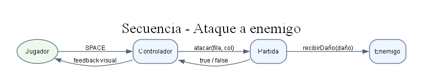
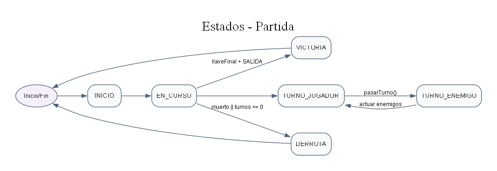
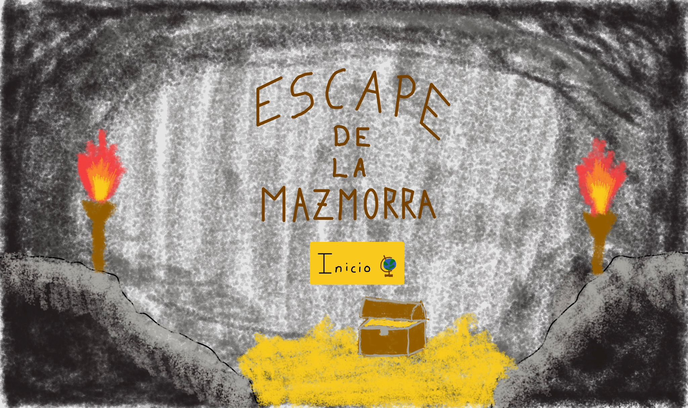

# Escape de la Mazmorra — Memoria del Proyecto

## 1. Introducción

### 1.1 Objetivo del proyecto

El objetivo de **Escape de la Mazmorra** ha sido desarrollar un juego por turnos en Java que combine lógica de videojuego, diseño orientado a objetos, estructuras de datos propias, persistencia JSON, una interfaz JavaFX y una batería de pruebas unitarias. El proyecto parte de una premisa sencilla: el jugador debe escapar de una mazmorra formada por tres cuevas conectadas, sobreviviendo a enemigos, gestionando objetos y alcanzando la salida final después de derrotar al jefe.

Aunque el resultado final tiene una presentación visual más elaborada que la versión mínima prevista al inicio, el foco académico del proyecto se mantiene en demostrar que el equipo sabe diseñar y justificar estructuras de datos propias, organizar capas de software, separar responsabilidades y documentar decisiones técnicas. La interfaz gráfica, la música, las animaciones y el ranking no sustituyen a ese objetivo principal, sino que lo complementan con una experiencia jugable más completa.

El proyecto debía demostrar, como mínimo, los siguientes puntos:

- Diseño orientado a objetos con herencia, composición e interfaces.
- Uso de estructuras propias en lugar de colecciones prohibidas de Java.
- Representación de la mazmorra como un grafo dirigido de cuevas.
- Representación de cada cueva como una matriz propia.
- Movimiento por turnos, con separación entre movimiento y acción.
- Inventario, objetos, equipo y llaves.
- Enemigos, combate, jefe final y condiciones de victoria/derrota.
- Persistencia JSON para configuración, guardado/carga y ranking.
- Interfaz JavaFX clara y usable.
- Pruebas unitarias JUnit para las partes no visuales.
- Documentación de coordinación, decisiones, tareas, revisión y postmortem.

### 1.2 Descripción del juego

**Escape de la Mazmorra** es un juego de exploración por turnos. El jugador controla a un mago atrapado en una mazmorra formada por tres cuevas de dificultad progresiva:

- **Las Criptas de Marfil**, la cueva fácil.
- **El Páramo Putrefacto**, la cueva media.
- **El Abismo de Malakor**, la cueva difícil y final.

En la primera planificación se habló de cuevas pequeñas de 7x7, 10x10 y 13x13. Durante el desarrollo se rediseñaron para mejorar la jugabilidad, la sensación de progresión y el uso de niebla de guerra. El estado final cargado desde `datos/cuevas.json` utiliza mapas de:

- 15x15 para `cueva_facil`.
- 19x19 para `cueva_media`.
- 23x23 para `cueva_dificil`.

El jugador avanza por las cuevas mediante movimiento por celdas. Cada turno permite como máximo un movimiento y una acción. Las acciones principales son atacar, lanzar hechizos, recoger objetos, abrir cofres, usar pociones, equipar armas o escudos, comprar visión del camino y terminar el turno para que actúen los enemigos. Cuando el jugador pasa turno, los enemigos vivos de la cueva actual se acercan o atacan según su posición.

La partida termina en victoria si el jugador derrota al jefe final, obtiene la llave final y llega a una celda de tipo `SALIDA`. La partida termina en derrota si la vida del jugador llega a cero o si se queda sin turnos disponibles. Al cambiar de cueva, el juego reinicia los turnos de esa zona a 60, de acuerdo con la regla final documentada en las tareas del proyecto.

### 1.3 Tecnologías utilizadas

El proyecto combina varias tecnologías y recursos:

- **Java** como lenguaje principal.
- **JavaFX** para la interfaz gráfica, escenas, controles, animaciones y reproducción multimedia.
- **Gson 2.10.1** para serialización y deserialización JSON.
- **JUnit 5** para pruebas unitarias.
- **PlantUML** para diagramas de clases, componentes, actividad, estados, secuencia y casos de uso.
- **JSON** como formato de configuración, guardado de partida y ranking.
- **Dungeon Asset Pack / assets locales** para sprites de personajes, objetos, cofres, armas, obstáculos, puerta y salida.
- **Suno AI** como herramienta de apoyo para generar música ambiental.
- **Agentes IA** como apoyo controlado en programación, documentación, revisión y coordinación.

Una precisión importante es que durante el desarrollo aparecen referencias a JavaFX 23 en la documentación de sesiones iniciales. Sin embargo, los scripts finales reproducibles (`scripts/run.ps1` y `scripts/test.ps1`) están preparados para usar el JDK 21 configurado en `C:\Users\UAH\.jdks\ms-21.0.10` y JavaFX 21.0.5 desde la caché local `.m2`. Por tanto, la memoria recoge ambas cosas: la intención técnica de trabajar con JavaFX moderno y el entorno final reproducible del repositorio.

La elección de estas tecnologías responde a una combinación de requisitos académicos y necesidades prácticas. Java permite trabajar con orientación a objetos clásica, interfaces, herencia, paquetes y control de tipos. JavaFX proporciona una forma directa de crear una interfaz de escritorio sin abandonar el ecosistema Java. Gson simplifica la lectura y escritura de JSON sin introducir una infraestructura pesada. JUnit permite validar el comportamiento de las piezas no visuales con pruebas automatizadas.

PlantUML se eligió porque permite mantener diagramas como texto versionable. Esto encaja bien con el flujo de GitHub: los diagramas se pueden revisar en Pull Requests igual que el código, y no dependen de archivos binarios difíciles de comparar. En un proyecto con varios integrantes y agentes, esta trazabilidad es especialmente útil.

Los assets visuales y de audio se trataron como recursos de apoyo, no como núcleo técnico. El juego debía poder justificarse aunque el aspecto gráfico fuera simple. Sin embargo, la incorporación de sprites, iconos, música y efectos ayudó a que la entrega fuera más clara para el usuario durante una demostración.

## 2. Metodología de trabajo

### 2.1 Patrón MVC

El proyecto se organizó siguiendo una separación cercana al patrón MVC. No se trata de un MVC formal de framework, pero sí de una división clara entre modelo, vista, control y persistencia.

La capa de **modelo** contiene las reglas del juego y los datos de dominio. Dentro de ella aparecen:

- `modelo/juego/`: partida, mazmorra, puertas, estados, resultados de impacto, estadísticas, vistas DTO para JavaFX y fábrica de partida.
- `modelo/mapa/`: cuevas, celdas, posiciones y tipos de celda.
- `modelo/personajes/`: jugador, enemigos, jefe final y tipos de enemigo.
- `modelo/objetos/`: objetos, armas, espada, arco, escudo, llave y poción.
- `Estructuras/`: listas propias, cola, grafo e iteradores.

La capa de **vista** contiene las pantallas y componentes JavaFX:

- `PantallaJuego`, con grid, paneles de estado, inventario, acciones, ayuda, pausa, niebla y animaciones.
- `PantallaIntroduccion`, con la narrativa inicial.
- `PantallaTransicion`, para el paso entre cuevas.
- `PantallaFinal`, con estadísticas, puntuación y resultado.
- `ReproductorMusica` y `ReproductorSfx`, para música y efectos.
- `DatosTemaCueva`, como fuente visual centralizada por cueva.

La capa de **control** contiene la aplicación JavaFX y la coordinación del flujo:

- `EscapeMazmorraApp`, como entrada principal de JavaFX, menú y pantallas iniciales.
- `ControladorFlujo`, como coordinador entre introducción, transición, juego y final.
- `JuegoController`, como traductor de teclado/clics a acciones de `Partida`.

La capa **JSON** contiene DTOs, cargadores y serializadores:

- DTOs de partida, mazmorra, cuevas, jugador, enemigos, objetos, puertas, conexiones y resultados.
- `CargadorConfiguracion`, para construir la mazmorra inicial desde `datos/cuevas.json`.
- `SerializadorPartida`, para guardar y cargar partidas.
- `SerializadorRanking`, para persistir el ranking local.

Los diagramas UML de clases, control y vista se conservan en la carpeta `diagramas uml/` como fuente técnica del proyecto. Para la versión PDF se ha priorizado la legibilidad del texto, por lo que los diagramas de gran tamaño no se insertan dentro del cuerpo de la memoria.

La ventaja de esta separación es que la lógica del juego puede probarse sin abrir JavaFX. Por ejemplo, `PartidaTest` puede comprobar victoria, derrota, daño, movimiento o tesoros sin crear una ventana. Del mismo modo, `CargadorConfiguracionTest` puede validar que el JSON construye datos correctos sin depender de la interfaz. Esto reduce el coste de comprobar cambios y permite detectar errores antes de llegar a la capa visual.

Otra ventaja es que JavaFX no necesita conocer todos los detalles internos del modelo. La vista no tiene que saber cómo se almacenan los nodos del grafo o cómo se recorre `ListaSE`. Solo necesita consultar vistas del estado y enviar acciones de alto nivel. Esta decisión fue importante para proteger las invariantes internas: si la interfaz pudiera mover directamente al jugador cambiando coordenadas, podría saltarse reglas como una acción por turno, bloqueo por enemigos o requisitos de llave.

El patrón también ayudó a resolver un problema habitual en juegos pequeños: la tentación de poner lógica dentro de la interfaz. En este proyecto, algunas animaciones y elementos visuales viven en `PantallaJuego`, pero las reglas de impacto, daño, estado y victoria siguen perteneciendo a `Partida`. Así, la interfaz puede cambiar de aspecto sin reescribir la lógica central.

### 2.2 Desarrollo iterativo incremental

La organización del proyecto fue iterativa e incremental. El trabajo se dividió en entregas pequeñas, normalmente de uno a tres días, con una revisión constante de la documentación compartida. No se siguió Scrum de forma estricta, pero sí una adaptación ligera con tareas, responsables, revisiones y cierres de sesión.

La evolución se puede resumir en tres grandes semanas:

- **Semana 1:** estructuras propias, matriz de cuevas, grafo, BFS, personajes y objetos base.
- **Semana 2:** lógica de partida, turnos, combate, JSON, guardado/carga y JavaFX mínimo.
- **Semana 3:** integración jugable, pulido visual, sonidos, animaciones, menú, ranking, hechizos, niebla de guerra y diagramas UML.

Cada iteración añadía funcionalidad sobre la anterior. Primero se cerraron piezas fundamentales, como `ListaSE`, `ListaDE`, `Cola`, `Grafo`, `Cueva` y `Mazmorra`. Después se añadieron personajes, inventario, objetos, combate y puertas. A continuación se conectó la configuración JSON con `FabricaPartida` y con la interfaz. Por último se pulieron mapas, assets, pantallas, animaciones, sonido y documentación.

Esta forma de trabajar permitió que las decisiones técnicas no quedaran solo en conversaciones. Cuando se detectaba un problema, se registraba en `DECISIONS.md`, `TASKS.md`, `SCRATCHPAD.md` o `POST_MORTEM.md`, según correspondiera. Así, cada agente o integrante podía recuperar contexto aunque no hubiera participado en una sesión anterior.

La metodología incremental también redujo el riesgo de bloqueo. Si una parte no estaba lista, otra podía avanzar con contratos provisionales o datos mock. El boceto JavaFX, por ejemplo, se diseñó antes de que `Partida` estuviera completamente cerrada. Eso permitió pensar la interfaz, pero también dejó claro qué métodos necesitaba exponer la lógica. Más adelante, cuando `Partida` y `FabricaPartida` maduraron, la vista pudo conectarse a la lógica real.

El inconveniente de este enfoque es que algunas piezas evolucionaron varias veces. Los mapas cambiaron de tamaño, las reglas de turnos se ajustaron, el menú tuvo varias versiones y la representación de assets se corrigió. Sin documentación, esos cambios habrían parecido contradicciones. Con documentación, se convierten en evolución justificable: el proyecto no empezó perfecto, sino que fue refinándose.

### 2.3 Sistema de agentes y workflow GitHub

El proyecto se repartió en tres partes principales, cada una con un responsable humano y un agente IA especializado:

- **Parte A:** Álvaro + Codex-A Estructuras.
- **Parte B:** Guille + Agente B Lógica.
- **Parte C:** Héctor + Agente C JavaFX/JSON/Docs.

Además, se definió un **Agente Revisor Independiente**, encargado de revisar cambios de código antes de considerarlos listos. Su papel fue importante porque detectó problemas que el autor de una implementación podía pasar por alto: exposición de referencias mutables, estados incoherentes de tablero, uso de estructuras no permitidas o falta de pruebas.

El flujo de ramas definido en `project-management/GITHUB_WORKFLOW.md` se basó en ramas de trabajo separadas:

- `feature/a-estructuras`.
- `feature/b-logica`.
- `feature/c-javafx-json-docs`.

La rama `main` debía recibir cambios mediante Pull Request revisada. En la práctica, algunas sesiones documentaron excepciones, por ejemplo cambios de interfaz o lógica hechos desde una rama de otra parte con autorización humana. Esas excepciones se registraron para que no se confundieran con una regla general.

Las reglas principales de trabajo fueron:

- No tocar archivos fuera del área asignada sin permiso.
- No usar colecciones prohibidas para sustituir estructuras propias.
- Crear o actualizar tests cuando se modificara código no visual.
- Mantener documentación compartida como fuente de verdad.
- Registrar decisiones importantes en `DECISIONS.md`.
- Registrar sesiones y contexto en `SCRATCHPAD.md`.
- Usar revisión independiente antes del merge.

El uso de agentes IA no se planteó como sustitución del equipo humano. Los agentes funcionaron como asistentes especializados: proponían implementaciones, ayudaban a revisar, generaban documentación, recordaban restricciones y ejecutaban comprobaciones. Las decisiones de alcance, prioridades y aceptación seguían dependiendo del grupo.

Esta forma de trabajo exigió disciplina. Un agente puede avanzar rápido, pero también puede perder contexto o asumir decisiones no confirmadas. Por eso se definieron reglas específicas: leer documentación al inicio, no tocar áreas ajenas sin permiso, registrar cambios, explicar tests y cerrar sesiones con resumen. El resultado fue una colaboración más controlada, donde la IA aumentó productividad sin eliminar responsabilidad humana.

El flujo GitHub completó esta organización. Las ramas por área permitían trabajar sin pisarse constantemente. Las Pull Requests daban un punto de revisión. Los documentos compartidos actuaban como contrato entre ramas. Cuando hubo excepciones, como modificaciones de `Partida.java` desde una rama de Parte A para tareas visuales autorizadas, se registraron explícitamente para mantener trazabilidad.

### 2.4 Documentación de coordinación

La documentación de `project-management/` fue una pieza central del proyecto. Su función no era solo producir entregables, sino mantener coordinación real entre equipo, agentes y revisiones.

- `PRD.md`: define el objetivo del producto, alcance mínimo, mundo del juego, acciones, objetos, enemigos y condiciones de victoria/derrota.
- `ARCHITECTURE.md`: describe principios, restricciones, paquetes, clases principales, contrato entre lógica e interfaz, estructuras propias y costes.
- `DECISIONS.md`: registra decisiones de diseño numeradas, desde la elección de matriz y grafo hasta ranking, flujo de pantallas y bola de fuego.
- `TASKS.md`: mantiene tareas por área, estados, responsables, criterios de terminado y verificaciones.
- `SCRATCHPAD.md`: actúa como diario técnico de sesiones, con cambios realizados, pruebas, riesgos y pendientes.
- `POST_MORTEM.md`: recoge lo que salió bien, lo que salió mal, causas probables y acciones decididas.
- `IA_DIARY.md`: registra el uso de IA, prompts, resultados, cambios aceptados y crítica.
- `AGENTS.md`: define reglas globales para agentes IA, límites de actuación, uso de tests y revisión.
- `GITHUB_WORKFLOW.md`: explica ramas, Pull Requests, documentación como fuente de verdad, mensajes de commit y conflictos.
- `REVIEW_CHECKLIST.md`: proporciona una lista de comprobación para el revisor independiente.

Esta documentación ayudó a evitar que el proyecto dependiera de memoria informal. Cuando el código cambió de tamaño de mapas, reglas de victoria, turnos, iconos o flujo de pantallas, el cambio quedó reflejado en documentos consultables.

También permitió separar tipos de información. No todo debía ir al mismo archivo:

- Una decisión estable iba a `DECISIONS.md`.
- Un estado de tarea iba a `TASKS.md`.
- Una sesión con cambios y pruebas iba a `SCRATCHPAD.md`.
- Un problema o aprendizaje iba a `POST_MORTEM.md`.
- Un uso concreto de IA iba a `IA_DIARY.md`.

Esa separación evita que la documentación se convierta en un bloque inmanejable. Cada archivo responde a una pregunta distinta: qué queremos hacer, qué hemos decidido, qué hemos hecho hoy, qué salió mal y cómo hemos usado IA.

### 2.5 Evolución del desarrollo

Una parte importante del proyecto fue su evolución desde prototipos simples hasta una versión jugable con interfaz y pulido visual. Esta evolución se reconstruye principalmente a partir de `DECISIONS.md`, `TASKS.md` y `SCRATCHPAD.md`.

#### Fase 1: prototipo de terminal

La primera idea funcional era demostrar la lógica del juego antes que su aspecto. El mapa podía representarse con símbolos sencillos, como muros, suelo, jugador, enemigos y objetos. Esta fase ayudó a fijar conceptos de tablero, movimiento, objetos, vida, ataque y turnos sin depender todavía de JavaFX.

El valor de esta fase fue reducir incertidumbre: antes de dibujar sprites o diseñar menús, el equipo necesitaba saber que el jugador podía moverse, atacar, recoger objetos, usar inventario y terminar una partida.

#### Fase 2: estructuras, mapa y grafo

Después se trabajó en la base académica del proyecto. Se eligió que `Mazmorra` contuviera un `Grafo<Cueva>` y que cada `Cueva` contuviera una matriz propia `ListaSE<ListaSE<Celda>>`. Esta decisión aparece en `DECISIONS.md` como una frontera clara: la mazmorra no es un grafo por herencia, sino un concepto del juego que usa un grafo como detalle de implementación.

En esta fase se implementaron y probaron:

- Listas propias.
- Cola propia.
- Grafo dirigido.
- Matriz de celdas.
- BFS para celdas alcanzables.
- Camino mínimo y distancia mínima.

También se detectaron riesgos en estructuras heredadas de prácticas anteriores, como restricciones genéricas demasiado fuertes o interfaces incompletas. La solución fue adaptar las estructuras al proyecto sin forzar que clases como `Celda` o `Cueva` implementaran `Comparable` cuando no tenían un orden natural.

#### Fase 3: lógica jugable

La siguiente fase añadió personajes, objetos e inventario. Se definió una jerarquía de `Personaje`, `Jugador`, `Enemigo` y `Boss`, y otra jerarquía de `Objeto`, `Pocion`, `Arma`, `Espada`, `Arco`, `Escudo` y `Llave`. El inventario del jugador quedó implementado con `ListaDE<Objeto>`.

Después se construyó `Partida` como fachada principal de la lógica. Esta clase coordina mazmorra, jugador, enemigos, objetos, puertas, turnos, log, estado, estadísticas y condiciones de fin. Fue una clase compleja, y precisamente por eso la revisión independiente resultó relevante: ayudó a separar métodos de montaje de acciones de juego, evitar solapes entre jugador y enemigos, y reducir exposición mutable.

En esta fase también se cerraron reglas fundamentales:

- El jugador puede moverse una vez y actuar una vez por turno.
- Los enemigos actúan al pasar turno.
- El daño se calcula como ataque menos defensa, con mínimo 1.
- El arco permite ataque a distancia.
- Las puertas requieren llaves concretas.
- La victoria exige derrotar al boss, conseguir la llave final y pisar `SALIDA`.

#### Fase 4: JSON y construcción de partida

La capa JSON empezó cargando la configuración de cuevas, enemigos, objetos y conexiones desde `datos/cuevas.json`. Más adelante se añadió `FabricaPartida` para construir una `Partida` completa a partir de `ResultadoCarga`.

Esta fase fue clave para que el juego dejara de depender de datos creados manualmente en tests. La configuración pasó a ser una fuente externa, revisable y modificable, con DTOs planos adaptados a Gson.

También se añadieron guardado y carga de partida, incluyendo estado de jugador, mazmorra, enemigos vivos, objetos en suelo, puertas y estadísticas. Finalmente se incorporó el ranking local en `ranking.json`.

#### Fase 5: boceto visual y JavaFX mínimo

Antes de construir la interfaz final, se diseñó un boceto ASCII de la pantalla de juego en `docs/BOCETO_JAVAFX.md`. Este documento definió cinco zonas: cabecera, matriz, estado del jugador, inventario/acciones y log.

Además del boceto ASCII, se preparó una primera idea visual para la pantalla inicial. Esa propuesta manual muestra una cueva gris, dos antorchas laterales, el título centrado, un botón de inicio y un cofre con tesoro en la parte inferior:

Ese boceto no se implementó de forma literal, pero sirvió para fijar una intención visual: pantalla de inicio con estética de mazmorra, luces laterales y un elemento de tesoro como reclamo.

La primera JavaFX mínima permitió abrir el menú, iniciar una partida, mostrar el mapa, representar jugador/enemigos/objetos y ejecutar acciones con teclado. A partir de ahí se integró con `Partida`, en lugar de usar datos mock.

#### Fase 6: versión jugable integrada

Una vez conectadas lógica, JSON y JavaFX, el juego ya permitía iniciar partida, moverse por cuevas, combatir, recoger objetos, usar inventario, avanzar por puertas, guardar/cargar y llegar a victoria o derrota.

En esta fase aparecieron ajustes importantes:

- Cambiar turnos de 40 a 60 por cueva.
- Auto-avance al pisar una puerta si se cumple el requisito.
- Pantallas narrativas de introducción, transición y final.
- Modal de nombre de jugador.
- Pantalla de controles.
- Menú de pausa.
- Ranking local.

La versión jugable fue el punto en el que el proyecto dejó de ser una suma de partes y pasó a ser una aplicación completa.

#### Fase 7: pulido final

La última fase añadió mejoras audiovisuales y ajustes de experiencia:

- Mapas más grandes y laberínticos.
- Obstáculos `ROCA` y `ARBUSTO`.
- Niebla de guerra con radio 3.
- Sprites del Dungeon Asset Pack y recursos locales.
- Animaciones de movimiento, ataque, muerte y proyectiles.
- Bola de fuego y bola de hielo.
- Ataque direccional con `Shift + WASD/flechas`.
- Efectos de sonido y música.
- Limpieza de assets no usados.
- Diagramas UML finales.

También se corrigieron problemas detectados durante pruebas visuales, como el uso de cofres como placeholder de rocas y arbustos, la necesidad de iconos específicos para poción/escudo/tesoro/salida y la posición del menú para que el cofre decorativo no tapara controles.

El pulido final también tuvo una dimensión de limpieza. Se eliminaron assets no referenciados y se reorganizó el Dungeon Asset Pack bajo `datos/dungeon-asset-pack/`. Esta limpieza no cambia las reglas del juego, pero sí facilita entender qué recursos son realmente necesarios. Para una entrega académica, reducir ruido en el repositorio ayuda a revisar y defender el proyecto.

La última fase de documentación incluyó la creación y reorganización de diagramas UML: clases, componentes, casos de uso, secuencia, estados y actividad. Estos diagramas funcionan como puente entre el código y la memoria. No sustituyen a la explicación escrita, pero ayudan a visualizar relaciones que en texto serían más pesadas.

En conjunto, la evolución del desarrollo muestra una transición clara: de estructura académica a aplicación jugable, y de aplicación jugable a entrega documentada.

### 2.6 Gestión de cambios y trazabilidad

La trazabilidad fue un aspecto importante porque el proyecto cambió varias veces durante su desarrollo. Algunas decisiones iniciales se mantuvieron, como usar grafo para cuevas y matriz propia para celdas. Otras evolucionaron, como tamaños de mapas, flujo de pantallas, turnos por cueva, representación visual y mecánicas extra.

Para que estos cambios fueran defendibles, se intentó dejar registro de tres cosas: qué se cambió, por qué se cambió y qué pruebas o verificaciones acompañaron el cambio. Esta forma de trabajar permitió explicar la diferencia entre el alcance mínimo inicial y el estado final del repositorio sin que pareciera una contradicción.

Por ejemplo, el cambio de mapas pequeños a mapas grandes aparece reflejado en tareas de pulido audiovisual y ajustes de tests. No fue solo un aumento arbitrario de dimensiones: buscaba mejorar exploración, permitir niebla de guerra y dar más espacio a enemigos, tesoros y obstáculos.

Otro ejemplo es el cambio de turnos de 40 a 60 por cueva. Con mapas más grandes, 40 turnos podían resultar escasos. La regla final de 60 turnos por cueva se documentó como parte de C-09.11 y se protegió con pruebas.

El ranking también surgió como mejora posterior. No estaba en el núcleo mínimo, pero se integró cuando la partida ya podía terminar y registrar estadísticas. La decisión se añadió en D-26, con reglas sobre nombre del jugador, puntuación, título y persistencia en `ranking.json`.

Esta trazabilidad evita presentar el resultado final como una lista de ocurrencias. Cada cambio importante tiene relación con una necesidad detectada: jugabilidad, claridad visual, presentación, revisión o estabilidad.

### 2.7 Papel de los documentos vivos

Los documentos del proyecto no se escribieron solo al final. Funcionaron como documentos vivos. Esto significa que se actualizaron mientras el proyecto avanzaba, y no únicamente como memoria posterior.

Esta forma de trabajo tiene ventajas y riesgos. La ventaja principal es que permite conservar contexto. Si un agente o integrante se incorpora a una sesión, puede leer tareas, decisiones y scratchpad para entender el estado actual. El riesgo es que los documentos compartidos también pueden quedar desactualizados o contener información histórica que ya no representa el resultado final.

Por eso, al redactar esta memoria se ha priorizado el estado final real del repositorio. Cuando un documento antiguo dice 7x7, 10x10 y 13x13, pero `datos/cuevas.json` contiene 15x15, 19x19 y 23x23, la memoria documenta el dato final y explica que hubo evolución.

Esta decisión es importante para la defensa del proyecto. Una memoria final no debe repetir sin filtro todos los datos iniciales; debe mostrar qué se planificó, qué se implementó y por qué cambió.

## 3. Estructuras de datos propias

El proyecto exige estructuras propias y evita usar colecciones prohibidas de Java como sustituto de ellas. Esta restricción no es solo formal: condiciona el diseño de matriz, inventario, grafo, BFS, log y almacenamiento interno de contenidos.

El diagrama UML de estructuras se conserva en la carpeta `diagramas uml/` como fuente técnica del proyecto. En esta memoria se explican sus clases, costes y usos principales para evitar una imagen demasiado reducida en PDF.

### 3.1 ListaSE

`ListaSE<T>` es una lista simplemente enlazada implementada con `ElementoSE<T>`. Cada elemento contiene un dato y una referencia al siguiente nodo. Implementa la interfaz `Lista<T>` y se utiliza cuando se necesita una estructura simple, recorrible y coherente con las restricciones del proyecto.

Sus operaciones principales son:

- `add(T)`: inserta al principio en O(1).
- `addLast(T)`: inserta al final en O(n), porque no hay puntero a último.
- `get(int)`: accede por posición en O(n).
- `del(T)`: elimina buscando linealmente.
- `copy()`: crea una copia superficial de referencias.
- `getIterador()`: permite recorrer con `MiIterador`.

Los usos principales son:

- Matriz de `Cueva` como `ListaSE<ListaSE<Celda>>`.
- Log de partida.
- Almacenamiento interno de nodos y arcos del grafo.
- Resultados de BFS.
- Listas de puertas.
- Carga JSON y recorridos auxiliares.

La ventaja de `ListaSE` es que es sencilla, explicable y suficiente para tamaños pequeños o medianos. Su principal desventaja es que el acceso por índice es lineal. En una matriz de cueva, acceder a una celda concreta implica recorrer fila y columna.

En una cueva de 23x23, esta desventaja es aceptable porque el tamaño sigue siendo reducido. El coste teórico importa y se documenta, pero el rendimiento práctico es suficiente para un juego por turnos. No se ejecutan miles de operaciones por segundo como en un juego en tiempo real; la mayoría de acciones dependen de una pulsación del jugador o de un cálculo de BFS acotado.

`ListaSE` también ayudó a mantener una idea importante: no todo acceso a datos necesita ser óptimo si el objetivo académico es mostrar implementación de TADs. En una aplicación industrial, probablemente se elegiría un array o una estructura indexada para la matriz. En este proyecto, la elección se justifica por la restricción de estructuras propias.

### 3.2 ListaDE

`ListaDE<T>` es una lista doblemente enlazada implementada con `ElementoDE<T>`. Cada elemento mantiene referencia al anterior y al siguiente. La estructura conserva punteros a primero y último, por lo que puede insertar tanto al principio como al final en O(1).

Sus operaciones principales son:

- `add(T)`: inserta al principio en O(1).
- `addLast(T)`: inserta al final en O(1).
- `get(int)`: acceso por índice en O(n).
- `del(T)`: eliminación por búsqueda.
- `getPrimero()` y `getUltimo()`: acceso directo a extremos.
- `copy()`: copia superficial.
- `getIterador()`: recorrido con iterador propio.

Sus usos principales son:

- Inventario del jugador como `ListaDE<Objeto>`.
- Listas auxiliares de enemigos actuales.
- Listas de objetos actuales.
- Caché de imágenes en la vista.
- Ranking ordenado y presentación de resultados.

Se eligió para inventario porque permite insertar y eliminar objetos con más flexibilidad que una lista simplemente enlazada. Además, el inventario no requiere acceso aleatorio intensivo, sino recorrido, inserción, eliminación y consulta.

El inventario es un buen ejemplo de estructura elegida por comportamiento esperado. Un jugador recoge, usa, equipa y elimina objetos. No necesita ordenar objetos ni buscar por posición constantemente. Por eso una lista doblemente enlazada resulta adecuada: permite manipular elementos sin depender de arrays ni colecciones de Java.

La lista doble también se usó en algunos puntos visuales donde era necesario mantener una colección propia de elementos. Esta reutilización evitó caer en `ArrayList` o `HashMap`, especialmente en zonas donde habría sido cómodo pero contrario a las restricciones.

### 3.3 Cola

`Cola<T>` implementa una estructura FIFO con `ElementoSE<T>`, puntero a primero y puntero a último. Implementa `InterfazCola<T>`.

Sus operaciones principales son:

- `offer(T)`: inserta al final en O(1).
- `poll()`: extrae del principio en O(1).
- `peek()`: consulta el primero en O(1).
- `isEmpty()`: comprueba si está vacía.
- `clear()`: vacía la cola.

La cola se usa principalmente en algoritmos BFS:

- BFS dentro de `Cueva`, para celdas alcanzables, camino mínimo y distancia mínima.
- BFS en `Grafo`, para recorrido de cuevas y camino mínimo entre cuevas.
- Apoyo a animaciones o listas de eventos pendientes.

Su elección es natural porque BFS necesita procesar nodos en orden de descubrimiento. Usar una cola propia evita depender de `Queue` de Java, que estaba prohibida como estructura evaluada.

La cola es probablemente la estructura con justificación algorítmica más directa del proyecto. BFS sin cola pierde claridad. Se podría simular con listas, pero eso haría el algoritmo menos expresivo y mezclaría responsabilidades. Implementar `Cola<T>` permitió que el código de búsqueda se pareciera a la explicación teórica vista en clase.

Además, la misma idea aparece en dos niveles: dentro de una cueva y entre cuevas. En el primer caso, BFS recorre celdas implícitas de una matriz. En el segundo, BFS recorre nodos explícitos del grafo. Esta repetición ayuda a defender el proyecto porque muestra el mismo algoritmo adaptado a dos representaciones distintas.

### 3.4 Grafo

`Grafo<T>` es un grafo dirigido implementado con listas propias:

- `ListaSE<NodoGrafo<T>>` para nodos.
- `ListaSE<ArcoGrafo<T>>` para arcos.

Implementa `InterfazGrafo<T>` y permite:

- Añadir nodos.
- Añadir arcos dirigidos.
- Comprobar si existe un nodo.
- Comprobar conexiones.
- Obtener adyacentes.
- Recorrer en BFS.
- Calcular existencia de camino.
- Obtener camino mínimo.
- Obtener distancia mínima.

En el proyecto se usa como `Grafo<Cueva>` dentro de `Mazmorra`. Esto permite representar que las cuevas están conectadas de forma dirigida. La dirección es importante porque una conexión puede modelar progresión en la mazmorra.

La complejidad no es la misma que tendría una implementación con tablas hash o listas de adyacencia optimizadas. Como se usan listas propias, muchas búsquedas son lineales. Por ejemplo, comprobar visitados en BFS puede implicar recorrer una lista, elevando el coste. Sin embargo, para tres cuevas esta solución es adecuada, fácil de explicar y coherente con los requisitos.

La decisión de usar un grafo para cuevas también evita acoplar la progresión del juego a una lista fija. Aunque la versión final tiene tres cuevas en orden, el modelo permite representar conexiones dirigidas de forma general. En una ampliación futura podrían añadirse bifurcaciones, cuevas opcionales o rutas alternativas sin cambiar el concepto de `Mazmorra`.

Un detalle importante es que las puertas no son lo mismo que los arcos. El arco del grafo indica que existe una conexión estructural. La puerta indica si el jugador puede usar esa conexión según una llave. Esta separación evita que el grafo tenga que conocer reglas de inventario o combate.

### 3.5 Matriz de la cueva

Cada cueva se representa como:

```text
ListaSE<ListaSE<Celda>>
```

Esta decisión es una de las más importantes del proyecto. Un array bidimensional habría dado acceso O(1), pero no habría demostrado el uso de estructuras propias. Un `ArrayList<ArrayList<Celda>>` o `LinkedList<LinkedList<Celda>>` habría incumplido las restricciones del proyecto.

Las razones para usar `ListaSE<ListaSE<Celda>>` son:

- Mantiene coherencia con el resto del proyecto.
- Evita usar colecciones prohibidas.
- Permite recorrer con iteradores propios.
- Demuestra competencia en TADs.
- Encaja con una cueva de tamaño fijo, donde no hace falta insertar o eliminar filas dinámicamente.
- Permite usar BFS con `Cola` propia sobre vecinos implícitos.

La desventaja es clara: acceder a una celda por fila y columna no es O(1). Primero hay que recorrer la lista de filas y después la lista de columnas. Aun así, los tamaños finales de 15x15, 19x19 y 23x23 son manejables para la escala del juego.

Otra consecuencia de esta decisión es que JavaFX debe adaptarse al modelo, no al revés. En una interfaz gráfica sería tentador transformar la matriz a arrays o listas de Java para pintarla más cómodamente. El proyecto evita esa conversión como estructura principal. La vista puede recorrer la matriz y crear nodos visuales, pero el estado jugable sigue viviendo en estructuras propias.

El BFS de `Cueva` también trabaja sobre esta matriz. Cada celda no se almacena como nodo de un grafo permanente, sino que sus vecinos se calculan por posición. Esto reduce duplicación de estructuras: la matriz es la fuente del mapa, y el grafo solo se reserva para conectar cuevas.

La elección también tiene valor didáctico. Permite explicar por qué una solución menos eficiente puede ser correcta si cumple requisitos concretos y si el tamaño del problema está acotado. La memoria no oculta la desventaja; la usa como parte de la justificación.

### 3.6 Estructuras descartadas

Durante el proyecto se consideraron otras estructuras, pero no se implementaron como parte final:

- **Pila:** no se necesitó porque no hay sistema de deshacer, historial LIFO ni exploración DFS.
- **Lista circular:** se mencionó para rotación de turnos, pero el juego acabó usando un turno del jugador seguido por actuación de enemigos.
- **Árbol binario de búsqueda:** se descartó por complejidad innecesaria. No había búsquedas ordenadas que justificaran introducirlo.

Descartar estas estructuras también es una decisión técnica. No se trataba de usar todas las estructuras posibles, sino de elegir las necesarias y poder justificar su uso.

### 3.7 Comparativa de costes y usos

| Estructura | Operaciones fuertes | Operaciones débiles | Uso principal |
|---|---|---|---|
| `ListaSE` | Inserción en cabeza O(1), recorrido simple | Acceso por índice O(n), inserción final O(n) | Matriz, log, grafo, BFS |
| `ListaDE` | Inserción en ambos extremos O(1), eliminación más flexible | Acceso por índice O(n) | Inventario, listas actuales, cachés |
| `Cola` | `offer`/`poll` O(1) | No está pensada para búsqueda | BFS |
| `Grafo` | Modelo natural de conexiones | Búsquedas lineales por listas | Cuevas de la mazmorra |

La tabla muestra que ninguna estructura es universal. Cada una se eligió para un uso concreto. Esta es una idea importante del proyecto: saber implementar estructuras no significa usarlas indistintamente, sino entender sus costes y limitaciones.

### 3.8 Restricciones frente a comodidad

Una tensión constante fue la diferencia entre lo cómodo y lo permitido. En Java, muchas tareas serían más sencillas con `ArrayList`, `HashMap`, `Queue` o arrays. Sin embargo, el proyecto exigía demostrar estructuras propias. Por eso se evitaron esas colecciones como base de la lógica.

Esto afectó especialmente a tres zonas: la matriz de cueva, el grafo de mazmorra y las colecciones de objetos, enemigos y resultados. En la matriz, un array bidimensional habría simplificado acceso y pintado. En el grafo, un `HashMap<Cueva, Lista<Cueva>>` habría hecho más eficientes las búsquedas. En contenidos por cueva, un mapa de `Cueva` a lista de enemigos habría sido natural.

El proyecto eligió estructuras propias incluso cuando eso obligaba a escribir más código. Este sacrificio tiene sentido dentro del contexto académico. La memoria debe demostrar que el equipo conoce el coste de esa decisión. No se afirma que `ListaSE<ListaSE<Celda>>` sea la estructura más rápida para cualquier juego; se afirma que es adecuada para este proyecto, dadas sus restricciones, tamaños y objetivos.

La revisión independiente fue útil para vigilar estas restricciones. En una sesión se detectó uso de `HashMap` en una zona de caché, y se reemplazó por una estructura propia. Este tipo de revisión evita que pequeñas comodidades rompan el criterio general del trabajo.

### 3.9 Impacto de las estructuras en el diseño

Las estructuras propias no son un detalle aislado. Afectan a cómo se diseñan las clases. Por ejemplo, al no usar `HashMap`, `Partida` no almacena contenidos por cueva con una tabla de acceso directo, sino con una lista propia de registros internos. Esto hace que buscar el contenido de una cueva sea lineal, pero mantiene coherencia con las restricciones.

Del mismo modo, al no usar arrays para la matriz, `Cueva` debe construir filas y celdas mediante listas. JavaFX no puede asumir acceso directo O(1) como si fuera un array. Tiene que consultar el modelo mediante métodos y recorridos.

Estas decisiones hacen el código más largo, pero también más defendible en una asignatura centrada en estructuras. La dificultad no está solo en que la lista funcione, sino en usarla de forma consistente en un proyecto completo.

Una mejora futura sería crear adaptadores de lectura inmutable para recorrer estructuras propias de forma más cómoda desde la vista, sin exponer nodos internos ni usar colecciones prohibidas como almacenamiento principal.

## 4. Backend — Lógica del juego

### 4.1 `modelo.juego`

El paquete `modelo.juego` contiene la lógica central. La clase más importante es `Partida`, que actúa como fachada. Desde la interfaz o desde tests no se deberían modificar directamente celdas, enemigos u objetos internos, sino invocar métodos de alto nivel.

Las clases principales son:

- `Partida`: coordina estado, turnos, jugador, mazmorra, enemigos, objetos, puertas, log y estadísticas.
- `Mazmorra`: contiene el grafo de cuevas y la cueva actual.
- `Puerta`: representa una conexión jugable con requisito de llave.
- `EstadoPartida`: enum de estados principales.
- `EstadisticasPartida`: registra daño, muertes, turnos y calcula puntuación.
- `FabricaPartida`: construye una partida desde configuración JSON.
- `ConstantesJuego`: centraliza constantes como daño de bola de fuego, rango y radio de visión.
- `DisparoEnemigo`: representa disparos o eventos pendientes de enemigos.
- `ResultadoImpactoBolaFuego` y `ResultadoImpactoBolaHielo`: resultados inmutables para JavaFX.
- DTOs de visualización: `PersonajeEnMapa`, `ObjetoEnMapa`, `CeldaEnMapa`, `CuevaEnMapa`.

El diagrama UML específico de juego se conserva en la carpeta `diagramas uml/` como fuente técnica del proyecto. En el cuerpo de la memoria se desarrolla por escrito la responsabilidad de cada clase para facilitar la lectura.

`Partida` es deliberadamente una fachada. Esto facilita que JavaFX solo pida acciones como moverse, atacar, lanzar hechizo, recoger, abrir tesoro, terminar turno o guardar. La lógica valida si esas acciones son posibles y actualiza el estado.

La fachada también resuelve una tensión del proyecto: la interfaz necesita mucha información para pintar, pero no debe recibir referencias que le permitan romper reglas. Por eso existen clases de vista como `PersonajeEnMapa`, `CeldaEnMapa` y `CuevaEnMapa`. Estas clases permiten mostrar vida, posición, tipo de celda u objetos sin entregar directamente estructuras internas completas.

Durante el desarrollo, `Partida` fue una de las clases más revisadas. Inicialmente tenía riesgos de exponer demasiado estado o mezclar preparación de partida con acciones jugables. Después de la revisión independiente, se reforzó la idea de contrato público: la interfaz usa métodos de alto nivel, mientras que la construcción de datos corresponde a JSON, fábrica o tests.

`EstadisticasPartida` se añadió como mejora para no calcular puntuación solo al final de forma improvisada. La partida registra daño ejercido, daño recibido, enemigos muertos, bosses muertos y turnos jugados. Con esos datos, la pantalla final y el ranking pueden mostrar un resumen más rico.

### 4.2 `modelo.mapa`

El paquete `modelo.mapa` contiene las clases estructurales del tablero:

- `Cueva`.
- `Celda`.
- `Posicion`.
- `TipoCelda`.
- Interfaces de posición, celda y cueva.

`TipoCelda` define:

- `SUELO`.
- `MURO`.
- `PUERTA`.
- `TRAMPA`.
- `TESORO`.
- `INICIO`.
- `SALIDA`.
- `ROCA`.
- `ARBUSTO`.

`Cueva` contiene la matriz propia de celdas y operaciones de navegación. El movimiento interno no almacena un grafo permanente de celdas. En su lugar, cada celda tiene vecinos implícitos arriba, abajo, izquierda y derecha. Con esa base se calcula BFS para:

- Celdas alcanzables.
- Camino mínimo.
- Distancia mínima.

No se permite movimiento diagonal para desplazarse por el mapa. Las diagonales sí pueden aparecer en reglas de adyacencia de combate o recogida, pero no en el BFS de movimiento.

El diagrama UML del mapa se conserva en la carpeta `diagramas uml/` como fuente técnica del proyecto.

Los tipos `ROCA` y `ARBUSTO` se añadieron durante el pulido de mapas. Su objetivo es enriquecer el diseño de cuevas sin introducir nuevas reglas complejas. Funcionan como obstáculos visuales y jugables, reforzando la sensación de laberinto.

`TESORO` también evolucionó. En una primera idea podía tratarse como una celda transitable o como un objeto más. La versión final lo define como cofre cerrado no pisable, que se abre con `R` desde una celda cardinal adyacente. Al abrirse, pasa a `SUELO` y entrega una recompensa. Esta decisión mejora la claridad visual: el cofre es un elemento del mapa, no simplemente un objeto suelto.

`TRAMPA` aparece como tipo de celda previsto y permite futuras ampliaciones. Aunque el foco final no se centró en trampas complejas, mantener el tipo en el enum deja abierta una extensión natural del juego.

### 4.3 `modelo.personajes`

El modelo de personajes usa herencia:

```text
Personaje
  Jugador
  Enemigo
    Boss
```

`Personaje` contiene atributos comunes:

- Nombre.
- Vida actual y máxima.
- Ataque base.
- Defensa base.
- Movimiento.
- Fila y columna.

`Jugador` añade:

- Inventario con `ListaDE<Objeto>`.
- Arma equipada.
- Escudo equipado.
- Ataque total.
- Defensa total.
- Uso de pociones.
- Equipamiento de armas y escudos.

`Enemigo` añade:

- `TipoEnemigo`.
- Estado de congelación.
- Comportamiento de enemigo normal.

`Boss` hereda de `Enemigo` y representa el enemigo final. Al morir, permite obtener la llave final necesaria para ganar.

El diagrama UML de personajes se conserva en la carpeta `diagramas uml/` como fuente técnica del proyecto.

La herencia permite compartir reglas básicas de vida y posición. Por ejemplo, recibir daño o comprobar si un personaje está vivo es común a jugador y enemigos. Separar `Jugador` y `Enemigo` permite añadir comportamiento específico sin duplicar toda la base.

El sistema de congelación se incorporó para la bola de hielo. Un enemigo congelado no actúa durante varios turnos, lo que añade una decisión táctica al jugador. La bola de fuego hace daño; la bola de hielo controla temporalmente amenazas. Aunque ambos hechizos se disparan de forma parecida desde JavaFX, sus efectos de modelo son distintos.

Los tipos de enemigo permiten adaptar sprites, comportamiento y dificultad. En la versión final aparecen esqueletos, orcos, arqueros y boss. Los arqueros introducen ataque a distancia enemigo, lo que hace que el jugador no pueda basarse solo en evitar adyacencia.

### 4.4 `modelo.objetos`

La jerarquía de objetos es:

```text
Objeto
  Pocion
  Arma
    Espada
    Arco
  Escudo
  Llave
```

`Objeto` contiene datos comunes:

- Id.
- Nombre.
- Descripción.

`Pocion` añade puntos de curación. La poción normal cura 25 puntos y existen variantes más potentes, como la poción grande del Abismo.

`Arma` añade bonificación de ataque. `Espada` representa arma cuerpo a cuerpo y `Arco` permite ataque a distancia. El arco ocupa las dos manos, por lo que desequipa el escudo.

`Escudo` añade bonificación de defensa.

`Llave` contiene:

- Tipo de llave.
- Código de cerradura.

Las llaves se usan para atravesar puertas y para la condición final de victoria.

El diagrama UML de objetos se conserva en la carpeta `diagramas uml/` como fuente técnica del proyecto.

Una decisión importante fue que los objetos base no almacenan posición. Un objeto puede estar en el suelo o en el inventario. Si la posición estuviera dentro de `Objeto`, una poción seguiría teniendo coordenadas incluso después de recogerla. Para evitarlo, el proyecto usa `ObjetoEnMapa`, que asocia objeto, cueva y posición mientras el objeto está en el mapa.

El equipamiento también tiene reglas propias. El jugador puede tener un arma equipada y un escudo equipado, pero el arco ocupa las dos manos. Por tanto, equipar arco desequipa el escudo. Esta regla da sentido a la diferencia entre espada y arco: la espada permite defensa adicional, mientras que el arco da alcance a costa de protección.

Las llaves usan código de cerradura. Esto evita que una puerta dependa del nombre visible del objeto. Dos llaves podrían llamarse parecido, pero solo abre la puerta la que tiene el código adecuado. La llave final se busca por código, no solo por id, para evitar conflictos.

### 4.5 Flujo de juego

El flujo de un turno se puede resumir así:

1. El jugador está en estado de turno activo.
2. Puede realizar como máximo un movimiento.
3. Puede realizar como máximo una acción.
4. Puede elegir entre atacar, lanzar hechizo, recoger objeto, abrir tesoro, usar poción, equipar objeto, comprar visión o guardar.
5. Cuando pulsa terminar turno, actúan los enemigos.
6. Se comprueba victoria o derrota.
7. Si la partida sigue en curso, se inicia un nuevo turno del jugador.

Mover o actuar no termina automáticamente el turno. Esta decisión se tomó para dar más control al jugador y permitir combinaciones como moverse y luego atacar, o atacar y decidir después cuándo dejar actuar a los enemigos.

El diagrama de actividad del turno se conserva en la carpeta `diagramas uml/` como fuente técnica del proyecto.

El flujo se diseñó para ser fácil de explicar al jugador: en tu turno te mueves, haces una acción y decides cuándo terminar. Esto evita que una acción accidental cierre el turno. También hace más clara la interfaz, porque los botones pueden indicar si movimiento o acción ya se han consumido.

El cambio de cueva es un caso especial. En la versión final, si el jugador está sobre una puerta y cumple los requisitos, puede avanzar a la siguiente cueva. Al entrar, los turnos se reinician a 60. La transición visual entre cuevas se encarga de que el cambio no parezca un simple salto de mapa.

La compra de visión del camino es otra acción especial. Consume 5 turnos y revela una ruta hacia la puerta o salida relevante. Esta mecánica aprovecha los algoritmos de camino mínimo y da al jugador una herramienta de orientación, especialmente útil en mapas grandes con niebla de guerra.

### 4.6 Reglas de combate

La fórmula básica de daño es:

```text
daño = ataque - defensa
```

Si el ataque es válido, el daño mínimo es 1. Esto evita combates bloqueados donde un enemigo con mucha defensa hiciera imposible avanzar.

Las reglas principales son:

- Ataque cuerpo a cuerpo contra enemigos adyacentes, incluyendo diagonales.
- Ataque direccional con `Shift + WASD/flechas`.
- Ataque por clic sobre enemigo en JavaFX.
- Arco con alcance 3.
- Arqueros enemigos con alcance mayor.
- Bola de fuego con daño fijo 10 y rango 5.
- Bola de hielo con rango 5 y congelación de 3 turnos.
- Los proyectiles se animan en JavaFX, pero el impacto se aplica en `Partida`.

El flujo de ataque está documentado en:



El ataque direccional se añadió porque el ataque automático al enemigo adyacente más cercano podía ser ambiguo. Si varios enemigos rodean al jugador, el jugador debe poder elegir objetivo. Con `Shift + dirección`, la intención se vuelve explícita.

La bola de fuego se implementó como proyectil en tiempo real dentro de un juego por turnos. Esto no rompe el sistema de turnos porque lanzar el hechizo consume la acción del turno. La animación viaja con un `Timeline`, pero el daño final se aplica mediante `Partida`. Así, la parte visual se encarga del movimiento y la parte lógica del resultado.

La bola de hielo reutiliza la idea de proyectil, pero su efecto es congelar. Esta diferencia demuestra que la arquitectura permite añadir acciones con presentación parecida y reglas distintas.

### 4.7 Condiciones de victoria y derrota

Los estados principales son:

- `EN_CURSO`.
- `VICTORIA`.
- `DERROTA`.

La victoria requiere:

- Derrotar al boss final.
- Conseguir la llave final.
- Situarse sobre una celda `SALIDA`.

La derrota ocurre si:

- La vida del jugador llega a 0.
- Los turnos restantes llegan a 0.

La condición final se refinó durante el desarrollo. Al principio bastaba con llegar a la salida final o derrotar al jefe. La decisión final combina ambas cosas para que el cierre sea más coherente: el jugador no puede escapar sin vencer a Malakor y obtener la llave final.

El diagrama de estados está en:



La condición de victoria final obliga a completar el recorrido completo del juego: explorar cuevas, superar enemigos, derrotar al boss y llegar a salida. Si solo se pidiera llegar a la salida, el boss sería opcional. Si solo se pidiera derrotar al boss, la salida perdería sentido. La combinación de ambas condiciones hace que el objetivo sea narrativamente completo.

La derrota por turnos evita que el jugador pueda jugar indefinidamente sin consecuencias. La derrota por vida obliga a respetar enemigos y combate. Juntas, estas condiciones equilibran exploración y supervivencia.

### 4.8 Invariantes de la lógica

Además de reglas visibles para el jugador, el backend mantiene invariantes internas. Estas invariantes son condiciones que deberían cumplirse siempre para que el juego no entre en estados incoherentes.

Las más importantes son:

- El jugador no comparte celda con un enemigo vivo.
- Dos enemigos vivos no deberían ocupar la misma celda.
- El jugador no puede terminar un movimiento en una celda no transitable.
- El jugador no puede pisar un tesoro cerrado.
- El jugador no puede atravesar una puerta sin cumplir su requisito.
- Una acción no puede ejecutarse dos veces en el mismo turno.
- El movimiento no puede ejecutarse dos veces en el mismo turno.
- La victoria no se activa sin llave final y celda `SALIDA`.
- La derrota se activa si vida o turnos llegan a cero.

Algunas de estas invariantes surgieron por revisión. Por ejemplo, los solapes entre jugador y enemigos fueron detectados como riesgo. La solución no consistió solo en corregir un caso concreto, sino en añadir validaciones en colocación, movimiento y cambio de cueva.

Mantener invariantes es especialmente importante porque hay varias entradas al sistema: teclado, ratón, carga desde JSON y carga de partida guardada. Todas deben acabar respetando las mismas reglas.

### 4.9 Relación entre lógica y animación

Una dificultad interesante fue separar lo que ocurre en el modelo de lo que se ve en pantalla. Cuando el jugador lanza una bola de fuego, visualmente aparece un proyectil que avanza. Sin embargo, la decisión de si impacta, cuánto daño hace y si mata al enemigo pertenece al modelo.

La solución fue dividir responsabilidades:

- JavaFX crea y anima el proyectil.
- JavaFX detecta el avance visual por celdas.
- Cuando llega a una celda relevante, llama a `Partida`.
- `Partida` aplica daño o congelación.
- El resultado vuelve como objeto inmutable.
- JavaFX muestra efectos, sonido y feedback.

Este patrón evita que la animación se convierta en lógica oculta. Si mañana se cambia el aspecto de la bola de fuego, la regla de daño sigue estando en el mismo sitio.

### 4.10 Fachada y deuda técnica controlada

`Partida` es una fachada potente, pero también concentra mucha responsabilidad. Esto fue aceptable porque el proyecto tenía un alcance limitado y necesitaba una entrada clara para JavaFX, JSON y tests. Sin embargo, la memoria reconoce que existe deuda técnica.

En una versión futura podrían separarse componentes como:

- Gestor de turnos.
- Gestor de combate.
- Gestor de inventario.
- Gestor de puertas.
- Gestor de hechizos.
- Gestor de estadísticas.
- Gestor de log.

La decisión de mantenerlo en `Partida` durante esta entrega buscó simplicidad y facilidad de defensa. Dividir demasiado pronto habría aumentado el número de clases y contratos mientras el juego todavía cambiaba. La refactorización tendría más sentido cuando las reglas estuvieran estabilizadas, como ocurre al final de esta versión.

## 5. Frontend — Interfaz JavaFX

### 5.1 Evolución de la interfaz

La interfaz evolucionó en varias fases.

#### Fase 1: terminal

La primera representación del juego era conceptual y podía visualizarse en terminal. Las celdas se distinguían con símbolos, como `[M]` para muro, `[ ]` para suelo, `[J]` para jugador y `[E]` para enemigo. Esta fase sirvió para pensar en lógica y flujo antes de invertir tiempo en gráficos.

#### Fase 2: boceto inicial de pantalla

Antes de construir el menú final, se diseñó una primera pantalla inicial con estética de cueva. El boceto incluye antorchas a ambos lados, el título centrado, un botón de inicio y un cofre con monedas en la parte inferior:



La versión final no copia literalmente este dibujo, pero conserva ideas importantes: pantalla de inicio como entrada ambiental, uso de elementos de mazmorra, presencia de tesoro/cofre y estética oscura.

#### Fase 3: boceto ASCII de pantalla de juego

El boceto ASCII de `docs/BOCETO_JAVAFX.md` definió la disposición funcional de la pantalla de juego:

```text
+-------------------------------------------------------------------+
|  ESCAPE DE LA MAZMORRA                        [Cueva: Facil]      |
+-------------------------------------------------------------------+
|                            |  ESTADO DEL JUGADOR                  |
|                            |  Vida:      ████████░░  80/100       |
|                            |  Ataque:    15 (+12) = 27            |
|                            |  Defensa:   5                         |
|                            |  Movimiento: 3                        |
|                            |  Turnos:     35/40                    |
|    MATRIZ DE LA CUEVA      |  Cueva:     Cueva Facil              |
|    (GridPane centrado)     |                                       |
|                            |  INVENTARIO                           |
|    [M][M][M][M][M]         |  [1] Espada        (equipada)  [U]   |
|    [M][J][ ][ ][M]         |  [2] Pocion de cura           [U]   |
|    [M][ ][M][E][M]         |  [3] Llave dorada             [U]   |
|    [M][ ][ ][P][M]         |                                       |
|    [M][M][M][M][M]         |  ACCIONES                             |
|                            |  [↑] [↗] [→] [↘] [↓] [↙] [←] [↖]   |
|                            |  [Atacar] [Recoger] [Usar] [Equipar] |
|                            |  [Abrir puerta] [Esperar turno]      |
+-------------------------------------------------------------------+
|  LOG DE EVENTOS                                                    |
|  > Has entrado en la Cueva Facil.                                  |
|  > Te has movido a (1, 2).                                         |
|  > Has recogido una pocion.                                        |
|  > Has atacado al Goblin (10 de dano).                             |
+-------------------------------------------------------------------+
```

El boceto no era una simple imagen decorativa. Funcionó como contrato inicial entre lógica e interfaz: qué información debía consultar JavaFX, qué acciones debía poder enviar a `Partida` y qué paneles debía mostrar.

#### Fase 4: JavaFX final

La versión JavaFX final incorpora:

- Menú principal.
- Pantalla de introducción.
- Pantallas de transición entre cuevas.
- Pantalla de juego con grid.
- Pantalla final con estadísticas.
- Ranking.
- Ayuda.
- Pausa.
- Guardado/carga.
- Niebla de guerra.
- Animaciones.
- Sonido.
- Música.

La evolución de la interfaz también refleja la evolución del alcance. Al principio se necesitaba una pantalla funcional que mostrara matriz, inventario y log. Después se añadieron pantallas narrativas, ranking, pausa y efectos visuales. Esto obligó a pasar de una única pantalla de juego a un flujo completo controlado por `ControladorFlujo`.

El menú principal también tuvo varias iteraciones. Primero se buscó una versión clara y funcional. Después se experimentó con una versión más premium con marco, luces y composición más elaborada. Finalmente se ajustó para mantener una estética pixel art más simple y coherente con los recursos disponibles. Esta evolución queda registrada en `SCRATCHPAD.md` y `TASKS.md`.

La interfaz final intenta equilibrar legibilidad y ambiente. El juego necesita parecer una mazmorra, pero no a costa de ocultar información importante. Vida, turnos, inventario y acciones deben leerse con rapidez porque forman parte de la toma de decisiones.

### 5.2 Pantallas

La aplicación contiene varias pantallas:

- **Menú principal:** muestra el título, el acceso a iniciar partida, cargar partida, controles, ranking y salir. Se diseñó con estética de mazmorra, antorchas y elementos decorativos.
- **Introducción:** presenta la historia inicial del mago y prepara narrativamente la partida.
- **Transición:** aparece antes de cada cueva, con nombre, texto y tema visual.
- **Juego:** contiene el grid, estado, inventario, acciones, log, feedback, ayuda y pausa.
- **Final:** muestra victoria o derrota, estadísticas, puntuación y título obtenido.
- **Ranking:** lista las mejores partidas locales.
- **Ayuda:** overlay con controles.
- **Pausa:** menú durante la partida con continuar, guardar y volver al menú.

El flujo completo puede representarse así:

```text
Menú principal
  -> Introducción
  -> Transición Cueva I
  -> Juego Cueva I
  -> Transición Cueva II
  -> Juego Cueva II
  -> Transición Cueva III
  -> Juego Cueva III
  -> Pantalla final
  -> Ranking / Menú
```

Este flujo separa la experiencia en momentos. La introducción da contexto, las transiciones marcan progreso y la pantalla final cierra la partida con estadísticas. Sin estas pantallas, el juego sería funcional, pero más brusco.

### 5.3 Componentes visuales

Los componentes principales de la pantalla de juego son:

- **Grid del mapa:** representado con JavaFX, sprites, colores de terreno, niebla y overlays.
- **Panel de estado:** vida, ataque, defensa, turnos, cueva y datos del jugador.
- **Inventario:** objetos con icono, nombre, equipo y acciones.
- **Acciones:** botones para acciones de juego y guardado.
- **Log:** mensajes de eventos coloreados según tipo.
- **Feedback visual:** textos flotantes, flashes de celda y animaciones.
- **Niebla de guerra:** limita la visión con radio 3 y opacidad progresiva.
- **Animaciones:** movimiento, ataque, muerte, proyectiles y disparos enemigos.
- **Sonido y música:** efectos de acción y música de ambiente.

El diagrama UML de vista se conserva en la carpeta `diagramas uml/` como fuente técnica del proyecto.

El grid es el elemento central porque representa el tablero. Cada celda combina información de terreno, ocupantes y overlays. La vista debe decidir si muestra suelo, muro, puerta, salida, tesoro, jugador, enemigo, objeto, niebla o resaltado. Para evitar que todo esto rompa la lógica, la vista consulta datos y no modifica directamente el modelo.

El panel de inventario pasó de ser una lista simple a una presentación más cercana a RPG, con ranuras y acciones. Esto mejora la comprensión de equipo: no basta con saber que tienes un objeto, también importa si está equipado.

El log ayuda a explicar consecuencias. Cuando una acción falla o tiene efecto, el jugador necesita saber por qué. El log complementa el feedback visual y reduce la sensación de error silencioso.

La niebla de guerra es una de las mejoras visuales más importantes. En mapas grandes, mostrar todo el mapa desde el inicio reduce tensión. Limitar visión obliga a explorar y hace útil la compra de camino.

### 5.4 Controles

Los controles finales son:

| Acción | Control |
|---|---|
| Mover jugador | `WASD` o flechas |
| Atacar enemigo cercano | `SPACE` |
| Ataque direccional | `Shift + WASD/flechas` |
| Recoger objeto | `R` |
| Abrir cofre cercano | `R` |
| Terminar turno | `T` |
| Ayuda | `H` |
| Pausa | `P` o `ESC` |
| Bola de fuego | `F + flecha` |
| Bola de hielo | `C + flecha` |
| Atacar con ratón | Clic sobre enemigo |
| Mover con ratón | Clic en celda alcanzable |
| Guardar | Botón de guardar o menú de pausa |

El diseño intenta combinar teclado y ratón. El teclado permite jugar de forma rápida, mientras que el ratón ayuda a acciones visuales como atacar un enemigo concreto.

La pantalla de ayuda evita que el usuario tenga que recordar todos los atajos. Esto fue necesario porque el juego creció: al principio bastaban movimiento, ataque, recoger y turno; después se añadieron pausa, ayuda, hechizos, ataque direccional, guardar y visión.

El uso de `R` para recoger y abrir cofre se decidió porque ambas acciones son contextuales y relacionadas con interacción cercana. Si hay objeto, recoge; si hay tesoro cercano, abre. Esta simplificación reduce teclas sin perder claridad, siempre que la interfaz muestre el texto adecuado.

### 5.5 Assets y recursos

Los recursos gráficos se organizan principalmente en `datos/`:

- `datos/dungeon-asset-pack/`: sprites de personajes, armas, cofres, puerta, rocas y arbustos.
- `datos/iconos/`: iconos locales para poción, escudo, salida y tesoro.
- `datos/audio/`: música y sonidos cuando están disponibles.

Durante el desarrollo se detectó que algunos assets del pack no cubrían todas las necesidades. Por ejemplo, faltaban recursos claros para puerta, escudo, rocas o arbustos. La solución final fue añadir o crear iconos locales y evitar placeholders confusos.

La organización final de recursos también ayuda a distinguir origen y función. Los sprites generales del pack se mantienen en `datos/dungeon-asset-pack/`, mientras que los iconos creados o añadidos para necesidades concretas viven en `datos/iconos/`. Esto hace más fácil revisar qué recursos son externos y cuáles se incorporaron específicamente para el proyecto.

El audio sigue una estrategia similar. `ReproductorMusica` gestiona música de ambiente y `ReproductorSfx` gestiona efectos. Cuando faltan archivos concretos, algunos sonidos pueden generarse por código como fallback. Esta decisión reduce fallos por ausencia de assets.

### 5.6 Problemas encontrados en frontend

Los problemas más importantes fueron:

- Uso inicial de sprites de cofre para representar rocas y arbustos.
- Confusión visual porque obstáculos parecían cofres.
- Falta de assets claros para puerta, escudo, tesoro y salida.
- Reajustes del menú principal: versión simple, versión más elaborada y ajustes posteriores.
- Problemas de layout en pantallas y botones.
- Necesidad de capturar errores más amplios durante depuración visual.
- Dependencia de JavaFX local para probar visualmente desde IntelliJ o PowerShell.

El postmortem recoge especialmente el problema de rocas y arbustos. La lección fue clara: si no existe un asset adecuado, es preferible preguntar o crear uno sencillo antes que usar un placeholder engañoso.

Otro problema fue que las pruebas visuales no siempre son automatizables con JUnit. Aunque la lógica pueda estar cubierta, una interfaz puede fallar por layout, tamaños, capas superpuestas o recursos no encontrados. Por eso algunas verificaciones quedaron como validación manual en IntelliJ.

También se aprendió que el pulido visual puede cambiar requisitos de lógica. Por ejemplo, hacer tesoros no pisables y abribles desde una celda vecina obligó a ajustar `Partida`, tests y mensajes de interfaz. La frontera entre UI y lógica no significa que una nunca afecte a la otra; significa que los cambios deben entrar por el sitio correcto.

### 5.7 Relación entre boceto, ASCII y resultado final

La evolución visual tuvo tres documentos o artefactos principales:

- El boceto inicial de pantalla de inicio.
- El boceto ASCII de pantalla de juego.
- La implementación JavaFX final.

El boceto inicial servía para atmósfera. No definía clases ni métodos, sino intención visual: mazmorra, antorchas, tesoro y botón central. Era útil para imaginar la entrada al juego.

El boceto ASCII servía para estructura funcional. Separaba zonas, paneles y elementos informativos. Era menos artístico, pero más preciso para implementar.

La JavaFX final combina ambos enfoques. Conserva la idea ambiental del menú y la organización funcional de pantalla de juego, pero añade detalles que no estaban en los bocetos: ranking, ayuda, pausa, animaciones, niebla, guardado y hechizos.

Esta secuencia muestra una buena práctica de diseño: empezar con baja fidelidad, validar disposición y después implementar. El equipo no empezó creando sprites definitivos sin saber qué información debía aparecer.

### 5.8 Decisiones de accesibilidad y claridad

Aunque el proyecto no desarrolla un sistema completo de accesibilidad, sí toma decisiones orientadas a la claridad:

- Mensajes de log para explicar acciones.
- Feedback visual cuando una acción falla.
- Overlay de ayuda con controles.
- Botones con texto claro.
- Colores y sprites diferenciados por tipo de celda.
- Resaltado de celdas alcanzables y enemigos atacables.
- Niebla progresiva en lugar de ocultación brusca.

Estas decisiones son importantes porque un juego por turnos depende de que el jugador entienda estado y consecuencias. Si no sabe por qué no puede moverse o atacar, la experiencia se vuelve frustrante.

La ayuda integrada fue una respuesta directa al aumento de controles. Al añadir hechizos, pausa, ataque direccional y visión, el juego necesitaba una referencia dentro de la propia interfaz.

### 5.9 Iteraciones del menú principal

La pantalla de inicio tuvo varias versiones. El boceto inicial proponía una composición con cueva, antorchas, botón de inicio y cofre. La primera implementación buscó funcionalidad: que el usuario pudiera iniciar o navegar. Más tarde se probó una versión más elaborada, con marco, arco, iluminación y estilo premium. Finalmente se ajustó hacia una versión más simple y coherente con el estilo pixel art y los recursos reales.

Esta evolución muestra una tensión habitual en frontend: una pantalla más elaborada no siempre es mejor si dificulta mantenimiento o se aleja del estilo del resto del juego. En este caso, el menú debía ser atractivo, pero también claro, estable y consistente.

El cofre decorativo fue un buen ejemplo. Visualmente reforzaba la temática, pero en algunos ajustes podía tapar botones o distraer. La solución fue recolocar elementos y mantener la funcionalidad por encima de la decoración.

## 6. Persistencia JSON

La persistencia se divide en tres necesidades:

- Cargar configuración inicial.
- Guardar y cargar partidas.
- Guardar ranking.

El diagrama UML de la capa JSON se conserva en la carpeta `diagramas uml/` como fuente técnica del proyecto.

### 6.1 Configuración inicial

`datos/cuevas.json` contiene:

- Nombre de la mazmorra.
- Cuevas.
- Dimensiones.
- Mapa de celdas.
- Enemigos.
- Objetos.
- Conexiones.

`CargadorConfiguracion` usa Gson para deserializar el JSON en DTOs y construir objetos del modelo. El resultado se encapsula en `ResultadoCarga`, que después puede usar `FabricaPartida`.

La configuración final contiene tres cuevas:

- `cueva_facil`, Las Criptas de Marfil, 15x15.
- `cueva_media`, El Páramo Putrefacto, 19x19.
- `cueva_dificil`, El Abismo de Malakor, 23x23.

El JSON final no solo define dimensiones. También define el contenido inicial de cada cueva. Por ejemplo, la cueva fácil contiene esqueletos, un arquero, poción, llave y escudo; la media incrementa cantidad y dificultad de enemigos; la difícil contiene enemigos más fuertes, arqueros, el boss, arco y pociones. De esta forma, el aumento de dificultad no depende solo del tamaño del mapa, sino también de contenido y distribución.

Las conexiones del JSON se usan para crear el grafo de la mazmorra y las puertas asociadas. Esta separación permite que el archivo de datos describa tanto estructura como requisitos de progresión. La fábrica transforma esa información en objetos de modelo, manteniendo la lógica de validación dentro de Java.

Una ventaja de cargar desde JSON es que los mapas se pueden ajustar sin reescribir código. Durante el proyecto se modificaron tamaños, obstáculos, posiciones de objetos y accesibilidad de tesoros. Tener esta información en `datos/cuevas.json` hizo más sencillo iterar sobre la jugabilidad.

### 6.2 DTOs

Los DTOs son clases planas pensadas para Gson:

- `ConfiguracionMazmorra`.
- `ConfiguracionCuevaDTO`.
- `ConfiguracionEnemigoDTO`.
- `ConfiguracionObjetoDTO`.
- `ConexionDTO`.
- `DatosPartidaDTO`.
- `DatosMazmorraDTO`.
- `DatosCuevaDTO`.
- `DatosJugadorDTO`.
- `DatosEnemigoDTO`.
- `DatosObjetoDTO`.
- `DatosPuertaDTO`.
- `ResultadoPartidaDTO`.

La separación entre DTOs y modelo evita que Gson dependa directamente de jerarquías complejas o referencias circulares.

Los DTOs también simplifican la compatibilidad entre guardado y carga. El modelo puede tener métodos, invariantes y referencias entre objetos; el DTO solo almacena datos serializables. Por ejemplo, un enemigo guardado necesita tipo, nombre, vida, ataque, defensa, posición, estado vivo y turnos de congelación. No necesita guardar métodos ni comportamiento.

En objetos, el DTO incluye campos que no siempre se usan. Una poción usa curación; un arma usa bonificación de ataque; un escudo usa defensa; una llave usa tipo y código de cerradura. Este diseño plano evita crear un serializador polimórfico complejo, y es suficiente para el tamaño del proyecto.

El precio de esta simplicidad es que el código de reconstrucción debe interpretar correctamente el tipo. Si el JSON indica `POCION`, se crea una `Pocion`; si indica `ARCO`, se crea un `Arco`; si indica `LLAVE`, se crea una `Llave`. Esta conversión se mantiene centralizada para que no se repita por toda la aplicación.

### 6.3 Guardado y carga de partida

`SerializadorPartida` guarda el estado de partida en JSON. El guardado incluye:

- Mazmorra.
- Cueva actual.
- Estado del jugador.
- Inventario.
- Equipo.
- Enemigos vivos.
- Objetos en suelo.
- Puertas.
- Estado de partida.
- Turnos restantes.
- Estadísticas.

La carga reconstruye una `Partida` funcional, con enemigos, objetos y puertas restaurados. Esta parte fue especialmente importante porque una carga incompleta podría parecer correcta visualmente, pero romper reglas internas o perder progreso.

El guardado de partida tuvo varios retos:

- Guardar solo enemigos vivos o guardar también estado completo.
- Mantener objetos que siguen en suelo.
- Mantener inventario y equipo del jugador.
- No perder estado de puertas.
- Guardar estadísticas para que una partida cargada conserve puntuación final.
- Reconstruir referencias entre cuevas, puertas y mazmorra sin depender de punteros del proceso anterior.

La solución fue serializar datos suficientes para reconstruir. Al cargar, no se intenta recuperar objetos Java tal cual estaban en memoria; se crean de nuevo desde DTOs. Este enfoque es más robusto porque el JSON no depende de direcciones ni referencias internas.

El guardado también se integró en la interfaz. El jugador puede guardar desde la pantalla de juego o desde pausa, y cargar desde el menú principal. Esta integración convierte la persistencia en una funcionalidad real de usuario, no solo en tests de serialización.

### 6.4 Ranking

`SerializadorRanking` guarda resultados finales en `ranking.json`. Cada entrada se representa mediante `ResultadoPartidaDTO`, que incluye:

- Nombre del jugador.
- Resultado de victoria o derrota.
- Estadísticas.
- Puntuación.
- Título obtenido.

El ranking local muestra el Top 10 ordenado por puntuación descendente, usando estructuras propias y Gson.

La puntuación se calcula a partir de estadísticas de partida. Se premia matar enemigos y bosses, infligir daño y ganar; se penaliza recibir daño y gastar turnos. El objetivo no es crear un sistema competitivo perfecto, sino dar al jugador una valoración final que refleje cómo ha jugado.

El ranking también añade cierre a la experiencia. La pantalla final no se limita a decir victoria o derrota, sino que muestra nombre, estadísticas, puntuación y título. Esto convierte cada partida en un resultado registrable.

`ranking.json` se mantiene como dato local. No forma parte del estado fijo del proyecto porque cambia con cada ejecución. Por eso queda ignorado por Git.

### 6.5 Formatos persistidos

El proyecto trabaja con tres tipos de JSON:

- Configuración inicial.
- Guardado de partida.
- Ranking.

La configuración inicial describe el mundo base. Es relativamente estable y forma parte del repositorio. El guardado de partida describe una ejecución concreta del juego y puede cambiar constantemente. El ranking también es local y depende de partidas jugadas.

Separar estos formatos evita mezclar responsabilidades. `datos/cuevas.json` no debería contener estadísticas de una partida concreta. `ranking.json` no debería definir mapas. El guardado de partida no debería reemplazar la configuración base.

Esta separación también facilita pruebas. Se puede probar carga de configuración sin tocar ranking. Se puede probar serialización de partida con archivos temporales. Se puede probar ranking con entradas controladas.

### 6.6 Riesgos de persistencia

La persistencia tiene riesgos específicos:

- JSON mal formado.
- Campos ausentes.
- Tipos desconocidos.
- Posiciones fuera de mapa.
- Objetos colocados en muros.
- Enemigos solapados.
- Cambios de versión entre guardados antiguos y código nuevo.

El proyecto mitigó parte de estos riesgos con tests. Por ejemplo, se añadieron verificaciones para que los objetos del JSON real no aparezcan en muros u obstáculos, y para que los tesoros tengan al menos una celda vecina accesible. Como mejora jugable, los cofres podrían entregar recompensas aleatorias dentro de un conjunto controlado de objetos, manteniendo el equilibrio por cueva.

No obstante, una mejora futura sería añadir validación más formal de configuración, con errores claros antes de iniciar la partida. Esto permitiría detectar problemas de datos sin llegar a una excepción durante el juego.

### 6.7 Ventajas de usar Gson

Gson permitió centrarse en el modelo sin escribir parsers manuales. Para este proyecto era suficiente porque los formatos JSON son relativamente pequeños y controlados. La librería puede convertir DTOs sencillos sin mucha configuración adicional.

Otra ventaja es la legibilidad de los archivos. El JSON de cuevas puede revisarse manualmente y el ranking con pretty printing también es fácil de inspeccionar. Esto ayudó durante depuración, especialmente cuando se ajustaban posiciones de objetos, enemigos o tesoros.

La principal limitación es que Gson no valida por sí mismo las reglas del juego. Puede leer un enemigo en una celda de muro si el JSON lo dice. Por eso la validación no puede depender solo de deserializar; debe complementarse con tests y comprobaciones de construcción.

## 7. Pruebas

El proyecto contiene **223 tests JUnit definidos** según el conteo actual de anotaciones `@Test` en el directorio `test/`. En sesiones anteriores aparecen cifras como 189, 208 o 213 porque la suite fue creciendo durante el desarrollo. La cifra final debe validarse ejecutando:

```powershell
powershell.exe -ExecutionPolicy Bypass -File scripts\test.ps1
```

El script compila `src` y `test`, añade Gson, JUnit y JavaFX al classpath/module-path, y ejecuta JUnit Platform Console.

Las pruebas cubren varias áreas:

- **Estructuras:** `ListaSE`, `ListaDE`, `Cola`, `Grafo`.
- **Mapa:** `Cueva`, matriz, BFS, celdas alcanzables, camino mínimo y distancia mínima.
- **Personajes:** `Personaje`, `Jugador`, `Enemigo`, `Boss`.
- **Objetos:** `Pocion`, `Arma`, `Espada`, `Arco`, `Escudo`, `Llave`.
- **Juego:** `Partida`, `Mazmorra`, turnos, movimiento, combate, puertas, victoria, derrota, tesoros, hechizos y estadísticas.
- **JSON:** carga de configuración, serialización de partida, ranking y round-trip.
- **Vista no visual:** iconos y reproductores cuando es viable probar sin abrir ventana completa.

La estrategia de pruebas fue incremental. Cada vez que se cerraba una parte importante, se añadían tests específicos. Por ejemplo:

- Las estructuras se probaron antes de construir encima la matriz.
- `Cueva` se probó antes de integrarla con `Mazmorra`.
- `Partida` recibió tests después de revisiones independientes.
- JSON tuvo pruebas de carga y guardado.
- Ranking y estadísticas añadieron nuevos tests.
- Los hechizos ampliaron la suite al final.

No toda la interfaz visual puede probarse fácilmente con JUnit. Por eso la parte JavaFX combina tests unitarios de componentes auxiliares con validación manual desde IntelliJ o ejecución local.

### 7.1 Pruebas de estructuras

Las pruebas de estructuras verifican operaciones básicas y casos límite:

- Insertar en listas.
- Eliminar primero, último y elementos intermedios.
- Consultar tamaño.
- Comprobar existencia.
- Recorrer con iteradores.
- Operar con cola vacía.
- Mantener orden FIFO.
- Crear nodos y arcos de grafo.
- Comprobar camino mínimo.

Estas pruebas son fundamentales porque el resto del proyecto depende de las estructuras. Un error en `ListaSE` podría aparecer después como fallo en mapa, JSON o grafo, haciendo más difícil localizar la causa.

### 7.2 Pruebas de mapa y BFS

Las pruebas de `Cueva` comprueban dimensiones, acceso a celdas, tipos de celda, transitabilidad, celdas alcanzables y caminos. También protegen que el movimiento use cuatro direcciones y no diagonales.

BFS es crítico porque se usa tanto para movimiento del jugador como para IA enemiga, visión del camino y cálculo de rutas. Si BFS se equivoca, el jugador podría atravesar muros, enemigos podrían quedar bloqueados o la visión comprada podría señalar un camino imposible.

### 7.3 Pruebas de juego

`PartidaTest` es una de las suites más amplias. Cubre reglas como:

- Movimiento válido e inválido.
- Límite de un movimiento por turno.
- Ataque cuerpo a cuerpo.
- Ataque direccional.
- Daño mínimo.
- Derrota por vida.
- Derrota por turnos.
- Victoria con llave final y salida.
- Puertas con llave.
- Cambio de cueva.
- Cofres y tesoros.
- Bola de fuego.
- Bola de hielo.
- Estadísticas.

Estas pruebas fueron creciendo a medida que la revisión independiente detectaba riesgos. Por ejemplo, se añadieron casos para evitar solapes entre jugador y enemigos, proteger la condición de victoria y comprobar reglas de puerta.

### 7.4 Pruebas de JSON

Las pruebas JSON comprueban que:

- Se carga correctamente `datos/cuevas.json`.
- Las cuevas tienen dimensiones esperadas.
- Los enemigos y objetos aparecen en posiciones válidas.
- Los tesoros son accesibles.
- La serialización de partida conserva estado.
- El ranking guarda y carga resultados.

Estas pruebas son importantes porque el JSON es una frontera externa. Un error en datos puede no ser visible en compilación, pero romper la partida en ejecución. Validar el JSON real reduce ese riesgo.

### 7.5 Limitaciones de pruebas

La principal limitación es JavaFX. Algunas comprobaciones visuales requieren abrir ventana, comprobar posiciones, tamaños, capas, imágenes y comportamiento interactivo. Aunque existen herramientas para automatizar UI, el proyecto optó por pruebas JUnit en lógica y validación manual de interfaz.

Otra limitación es la dependencia de rutas locales de JavaFX. Los scripts finales ayudan a ejecutar el proyecto en el entorno del equipo, pero siguen dependiendo de que las rutas de JDK y JavaFX estén correctamente configuradas.

En cualquier caso, la existencia de más de doscientas pruebas unitarias da una base razonable de confianza para la lógica no visual.

### 7.6 Criterios de aceptación

Una prueba aislada no basta para considerar terminado el proyecto. Los criterios de aceptación finales combinan varios niveles:

- El código compila.
- La configuración JSON carga.
- La partida puede iniciarse.
- El jugador puede moverse.
- El jugador puede combatir.
- Los enemigos actúan.
- Se pueden recoger y usar objetos.
- Se pueden abrir cofres y atravesar puertas.
- Se puede guardar y cargar.
- Hay victoria y derrota.
- La pantalla final registra estadísticas.
- El ranking se actualiza.
- Los diagramas existen y reflejan la estructura.
- La memoria documenta decisiones y evolución.

Estos criterios muestran que el proyecto no se evalúa solo por tests unitarios. También importa que la aplicación funcione como experiencia completa.

### 7.7 Evolución del número de pruebas

El número de tests fue aumentando con el proyecto:

- Primero se probaron estructuras y mapa.
- Después personajes y objetos.
- Más tarde `Partida` y `Mazmorra`.
- Luego JSON y guardado/carga.
- Finalmente ranking, tesoros, iconos y hechizos.

En la documentación de sesiones aparecen cifras sucesivas: 148, 180, 182, 189, 208, 213 y finalmente 223 tests definidos. Esta progresión refleja que la suite acompañó al crecimiento del juego.

También muestra una práctica positiva: cuando se detectaba un defecto o se añadía una regla, se intentaba añadir una prueba asociada. Así, los errores corregidos no dependían solo de memoria.

### 7.8 Qué no cubren los tests

Aunque la suite es amplia, no cubre todo. Hay aspectos que quedan fuera o se validan manualmente:

- Calidad visual de pantallas.
- Fluidez real de animaciones.
- Volumen y sensación de audio.
- Experiencia de usuario al jugar una partida completa.
- Legibilidad del mapa en distintos tamaños de ventana.
- Correcta percepción de niebla, sprites y overlays.

Esto no significa que los tests sean insuficientes, sino que cada tipo de comprobación tiene su ámbito. JUnit es excelente para reglas deterministas; la interfaz gráfica requiere además observación manual o herramientas específicas de UI.

Una mejora futura sería añadir pruebas de arranque JavaFX o capturas automáticas, pero para esta entrega se priorizó cubrir la lógica no visual.

## 8. Crítica del proyecto

La crítica se basa principalmente en `project-management/POST_MORTEM.md`. También se apoya en hechos registrados en `SCRATCHPAD.md`, `TASKS.md` y `DECISIONS.md`, para relacionar los problemas detectados con decisiones y cambios concretos del desarrollo.

### 8.1 Lo que salió bien

La separación del trabajo en tres partes ayudó mucho. Parte A podía centrarse en estructuras, mapa y grafo; Parte B en lógica de juego; Parte C en JSON, JavaFX y documentación. Esta división redujo conflictos y permitió avanzar en paralelo.

También fue positivo detectar pronto riesgos en las estructuras propias. La corrección de restricciones genéricas permitió usar clases del modelo sin forzar `Comparable`. Esta decisión simplificó el diseño y evitó comparaciones artificiales.

La documentación compartida funcionó como memoria del proyecto. `TASKS.md` permitió saber qué estaba pendiente, en revisión o hecho. `DECISIONS.md` evitó repetir debates. `SCRATCHPAD.md` conservó contexto entre sesiones. `POST_MORTEM.md` obligó a mirar problemas de forma honesta.

La revisión independiente fue especialmente útil. Detectó exposición mutable, estados incoherentes del tablero, métodos de preparación en interfaces públicas y riesgos de tests insuficientes. Algunas de las mejoras más importantes de `Partida` salieron de esas revisiones.

También salió bien la evolución incremental. El juego no intentó empezar directamente con JavaFX completo, música, ranking y hechizos. Primero se construyó una base lógica y después se añadió pulido.

Otro acierto fue mantener una separación explícita entre requisitos mínimos y extras. Muchas funciones atractivas, como animaciones, hechizos o ranking, se incorporaron después de tener una versión jugable. Esto evitó que el proyecto se perdiera en detalles visuales antes de tener lógica.

También fue positivo aceptar cambios cuando la versión inicial no era suficiente. Los mapas pequeños servían para prototipo, pero no para una experiencia final con niebla y exploración. Cambiar a 15x15, 19x19 y 23x23 fue un ajuste razonado, no una improvisación aislada.

El uso de PlantUML como texto versionable también fue un acierto. Los diagramas se pudieron reorganizar y corregir sin depender de herramientas gráficas externas.

### 8.2 Lo que salió mal

El proyecto arrastró código reutilizado de prácticas anteriores. Ese código no siempre encajaba con las necesidades nuevas: había interfaces faltantes, restricciones genéricas fuertes y estructuras que necesitaban adaptación.

También hubo dependencia del entorno local. Durante parte del desarrollo la ejecución de tests dependía de IntelliJ o de scripts con rutas concretas a JDK y JavaFX. Aunque se añadieron scripts, la configuración sigue requiriendo que el entorno local tenga esas dependencias disponibles.

`Partida` concentró muchas responsabilidades. Es una fachada útil, pero también una clase grande que coordina demasiados aspectos: turnos, combate, enemigos, objetos, puertas, estadísticas, hechizos, visión y guardado. Para un proyecto pequeño es aceptable; para una versión mayor convendría extraer servicios o gestores.

Algunos métodos de montaje estuvieron inicialmente cerca del contrato público, lo que podía confundir acciones de juego con preparación de partida. La revisión ayudó a corregirlo.

En frontend, el uso de placeholders visuales incorrectos provocó confusión. Los cofres usados para rocas y arbustos son el ejemplo más claro.

Otro problema fue que algunas mejoras visuales se mezclaron con cambios de lógica. Por ejemplo, al mejorar cofres o puertas, no bastaba con cambiar sprites: había que ajustar reglas de movimiento, interacción y tests. Esto no es necesariamente malo, pero exige más coordinación.

También hubo cierta inestabilidad en la pantalla de inicio. Se probaron varias versiones y se acabó ajustando hacia una composición más simple. Esto muestra que el diseño visual requiere iteración, pero también que conviene definir criterios antes de invertir demasiado tiempo en una versión.

Finalmente, algunos documentos quedaron con información histórica que ya no coincidía con el estado final, como tamaños mínimos de mapas o versiones de JavaFX. La memoria corrige esto priorizando el estado final y explicando la evolución.

### 8.3 Problemas de coordinación

Hubo cambios en documentos compartidos que afectaban a otros agentes. Esto obligó a reforzar la norma de registrar decisiones y comunicar cambios importantes.

También aparecieron decisiones habladas en conversación que no estaban formalizadas. Cuando una decisión no queda en `DECISIONS.md`, otro integrante o agente puede asumir una regla distinta.

Otro problema fue la diferencia entre conexión estructural y regla jugable. `Mazmorra` conecta cuevas con el grafo; `Puerta` añade requisito de llave. Esta separación no era obvia al principio y tuvo que documentarse con precisión.

Finalmente, la memoria de sesiones anteriores no podía depender solo del chat. La solución fue usar `SCRATCHPAD.md` como registro técnico continuo.

La coordinación con agentes también tuvo un riesgo específico: un agente puede leer documentos desactualizados o no leer el contexto suficiente. Por eso se reforzó la regla de revisar documentación al inicio de sesión y de registrar cierre al final.

Otro punto delicado fue la propiedad de archivos compartidos. `Partida.java`, por ejemplo, afecta a lógica, JSON y JavaFX. Aunque pertenezca principalmente a la parte de lógica, algunas tareas visuales necesitaban tocarla para registrar proyectiles o efectos. La solución fue pedir autorización y documentar excepciones.

En un proyecto pequeño, estas excepciones son manejables. En un proyecto mayor, haría falta una política más estricta de ownership y revisiones cruzadas.

### 8.4 Lecciones aprendidas

Las principales lecciones son:

- Mantener documentación actualizada como fuente de verdad.
- Probar estructuras antes de construir capas superiores.
- No exponer referencias mutables si la interfaz solo necesita vistas.
- Separar acciones de juego y métodos de montaje.
- Registrar decisiones técnicas importantes.
- No usar placeholders visuales engañosos.
- Añadir revisión independiente antes del merge.
- Automatizar tests lo antes posible.
- Evitar depender de memoria informal de conversaciones.

También se aprendió que una memoria final no debe limitarse a describir el código como si hubiera nacido perfecto. Es más honesto y útil explicar cómo evolucionó: qué se descartó, qué se corrigió y por qué ciertas decisiones cambiaron. Esto demuestra criterio técnico.

Otra lección es que la interfaz no es solo decoración. Las decisiones visuales afectan al entendimiento del juego. Un icono incorrecto puede hacer que el jugador interprete mal una celda. Un log poco claro puede hacer que una acción parezca fallida. Un menú mal colocado puede tapar elementos importantes.

Por último, las pruebas no eliminan la necesidad de jugar. Muchas reglas pasan tests pero necesitan validación manual para comprobar que la experiencia tiene sentido.

### 8.5 Propuestas de mejora

Para futuros proyectos se proponen:

- Separar `Partida` en componentes más pequeños si el juego crece.
- Añadir más tests de integración.
- Crear un catálogo de assets desde el inicio.
- Definir contratos entre capas antes de implementar UI.
- Mantener un sistema de decisiones obligatorio para cambios de alcance.
- Añadir más tipos de enemigos, objetos especiales y mapas.
- Hacer que los cofres entreguen objetos aleatorios dentro de una tabla de recompensas equilibrada por cueva.

También sería recomendable:

- Añadir pruebas automáticas de carga de recursos visuales.
- Separar servicios dentro de `Partida`.
- Introducir un gestor de acciones para reducir condicionales grandes.
- Añadir un sistema de eventos tipados para el log.
- Generar documentación técnica a partir de diagramas renderizados.
- Añadir un modo de depuración para ver mapa completo, rutas BFS y estado interno.
- Mejorar accesibilidad visual con opciones de contraste.

### 8.6 Balance final del postmortem

El balance general es positivo, pero no porque todo saliera bien desde el principio. El proyecto tuvo problemas reales: dependencias locales, cambios de alcance, placeholders visuales, responsabilidades mezcladas y necesidad de revisar invariantes. Lo positivo es que esos problemas se detectaron y quedaron registrados.

La madurez del proyecto se ve en cómo respondió a los problemas:

- Si una estructura no encajaba, se adaptó.
- Si una regla era ambigua, se registró como decisión.
- Si una interfaz exponía demasiado, se corrigió.
- Si un asset confundía, se sustituyó.
- Si una prueba faltaba, se añadió.
- Si una sesión podía perder contexto, se documentó.

Esta capacidad de corrección es tan importante como la implementación inicial. En proyectos reales, el primer diseño rara vez es perfecto. Lo importante es tener mecanismos para aprender y ajustar sin perder control.

### 8.7 Papel de la revisión independiente

La revisión independiente merece una mención específica porque cambió el resultado del proyecto. No se limitó a mirar formato o estilo; detectó problemas de comportamiento:

- Exposición de referencias mutables.
- Métodos de preparación en interfaces públicas.
- Posibles solapes de ocupación.
- Riesgo de puertas mal modeladas.
- Tests insuficientes.
- Uso de estructuras no permitidas.

Esto demuestra que revisar código no es solo buscar errores sintácticos. Una buena revisión comprueba contratos, invariantes, restricciones del enunciado y mantenibilidad.

En el futuro, este papel debería mantenerse. Incluso con agentes IA, la revisión cruzada sigue siendo necesaria porque cada autor tiende a confiar demasiado en su propio enfoque.

### 8.8 Crítica sobre el uso de IA

El uso de IA fue una ventaja, pero también una responsabilidad. La IA ayudó a acelerar tareas, proponer código, redactar documentación y revisar riesgos. Sin embargo, no elimina la necesidad de criterio humano.

Los principales riesgos del uso de IA fueron:

- Asumir decisiones no confirmadas.
- Tocar archivos fuera del área asignada.
- Generar soluciones correctas en apariencia pero incoherentes con restricciones.
- Perder contexto entre sesiones.
- Depender demasiado del chat en lugar de documentos.

El proyecto mitigó estos riesgos con reglas para agentes, documentación viva, revisión independiente y diario de IA. Esta forma de uso es más defendible que simplemente decir que se usó una herramienta. Se explica para qué se usó, qué se aceptó, qué se rechazó y qué controles se aplicaron.

## 9. Conclusiones

**Escape de la Mazmorra** cumple el alcance principal del proyecto. El resultado final es un juego por turnos en Java con JavaFX, estructuras propias, grafo de cuevas, matriz propia, inventario, objetos, enemigos, combate, JSON, guardado/carga, ranking, pruebas y documentación.

El proyecto demuestra que se pueden combinar requisitos académicos con una experiencia jugable. La parte más importante no es solo que exista una interfaz con sprites, sino que debajo hay decisiones justificadas: `Mazmorra` contiene un grafo, `Cueva` contiene una matriz propia, el inventario usa `ListaDE`, BFS usa `Cola`, y JavaFX se comunica con la lógica a través de `Partida`.

El uso de agentes IA fue útil cuando se mantuvo dentro de límites claros. Los agentes ayudaron a implementar, revisar, documentar y recordar contexto, pero las decisiones importantes quedaron registradas y validadas por el equipo humano.

El mayor aprendizaje técnico fue la importancia de las fronteras: entre modelo y vista, entre configuración y acción de juego, entre datos internos y vistas inmutables, entre estructura académica y comodidad de programación. Cuando esas fronteras estaban claras, el proyecto avanzaba mejor.

Como ampliaciones futuras quedarían:

- Más cuevas.
- Más enemigos con comportamientos diferenciados.
- Objetos especiales.
- Modo difícil.
- Mapas generados proceduralmente.
- Más animaciones y efectos visuales.
- Cofres con recompensas aleatorias configurables.

El resultado final es especialmente interesante porque combina tres dimensiones. La primera es académica: estructuras propias, costes, BFS, grafo y matriz. La segunda es de ingeniería: separación en paquetes, JSON, tests, documentación y revisión. La tercera es de producto: una interfaz jugable, con feedback, progresión, narrativa y ranking.

No todas las decisiones son las óptimas para un videojuego profesional. Un array sería más eficiente que `ListaSE<ListaSE<Celda>>` para una matriz; una configuración de ejecución más independiente del entorno local facilitaría la distribución; una arquitectura con más servicios reduciría tamaño de `Partida`. Pero el proyecto no buscaba maximizar rendimiento industrial, sino cumplir un conjunto de restricciones académicas y producir una aplicación defendible.

La memoria muestra que las decisiones se tomaron con conciencia de sus costes. Esa es probablemente la parte más valiosa del proyecto: no solo implementar, sino saber explicar por qué se implementó así y qué se mejoraría después.

Desde el punto de vista del aprendizaje, el proyecto obligó a conectar temas que a veces se estudian separados. Las estructuras de datos no quedaron como ejercicios aislados; se usaron dentro de mapa, grafo, inventario, BFS, ranking y log. La programación orientada a objetos no quedó como teoría; se aplicó en personajes, objetos, DTOs y capas. JSON no fue solo lectura de archivos; se integró en carga, guardado y ranking. JavaFX no fue solo una ventana; se convirtió en interfaz completa con flujo de pantallas.

Desde el punto de vista del equipo, el proyecto muestra la importancia de coordinar. Tres personas trabajando con agentes pueden avanzar rápido, pero solo si existe una fuente de verdad común. Sin `TASKS.md`, `DECISIONS.md` y `SCRATCHPAD.md`, habría sido difícil reconstruir por qué se hicieron ciertos cambios.

Desde el punto de vista de producto, el juego es ampliable. La estructura de cuevas permite más mapas; la jerarquía de enemigos permite nuevos tipos; los objetos pueden crecer con nuevas subclases; JSON permite cambiar configuración; JavaFX puede añadir nuevas pantallas. El proyecto no está cerrado a evolución.

En conclusión, **Escape de la Mazmorra** es una entrega que combina funcionalidad, justificación técnica y reflexión sobre el proceso. No solo muestra qué se hizo, sino cómo se llegó hasta ahí.

El valor final de la memoria es que permite defender el proyecto desde varias perspectivas. Si se pregunta por estructuras, hay justificación de costes y usos. Si se pregunta por arquitectura, hay separación por paquetes y capas. Si se pregunta por metodología, hay tareas, decisiones y postmortem. Si se pregunta por evolución, hay una cronología clara desde prototipos hasta JavaFX final. Esto hace que el proyecto sea explicable, no solo ejecutable, y deja una base ordenada para preparar la presentación, el vídeo y la defensa oral.
