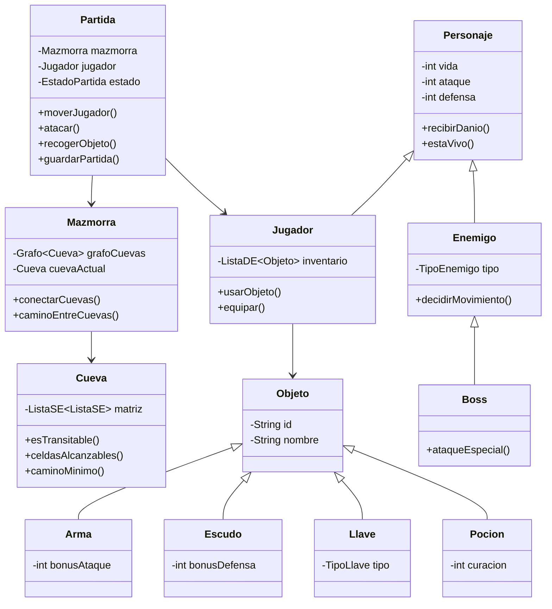
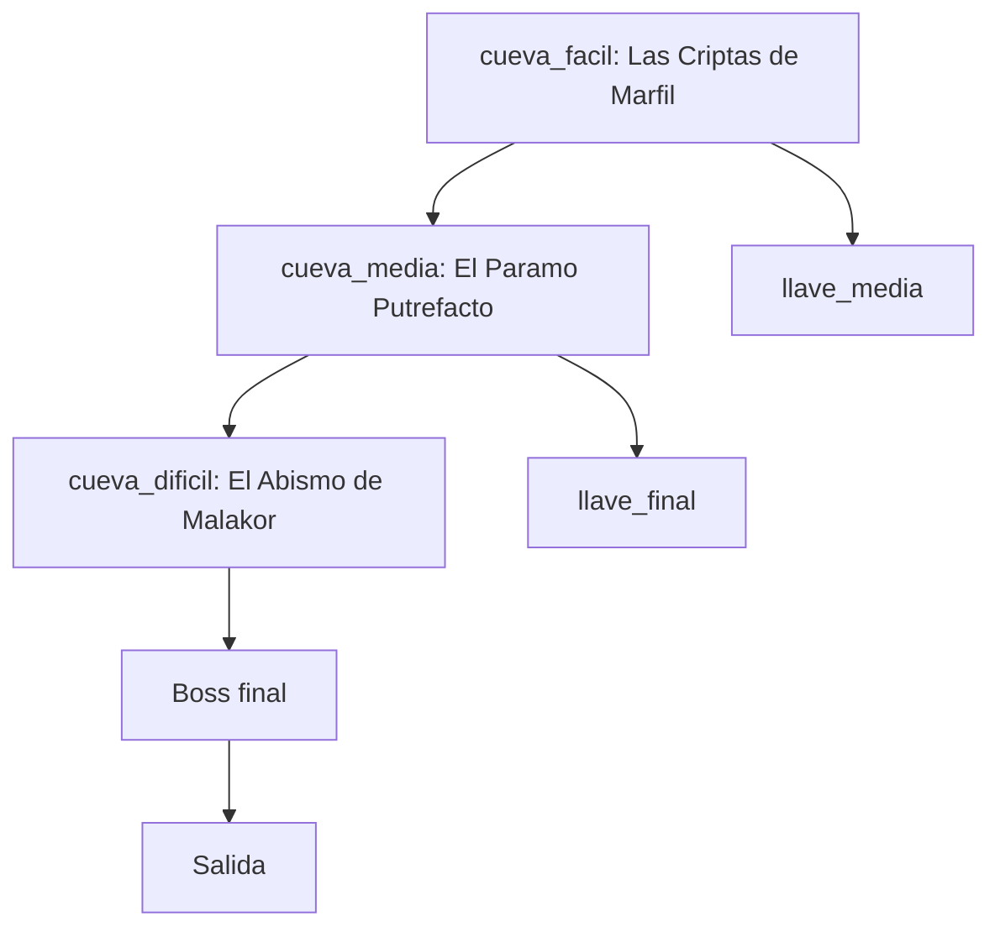

# Escape de la Mazmorra

## Memoria del proyecto

**Alumnos**

- Alvaro Martinez del Campo
- Guillermo Salgado Malcuori
- Hector Montero Plaza

**Asignaturas**

- Metodologia de la Programacion
- Estructuras de Datos

**Grado**

- Matematicas y Computacion
- Universidad de Alcala, UAH

**Fecha**

- 27 de mayo de 2026

---

# 1. Arquitectura y diseno orientado a objetos

Escape de la Mazmorra es un juego por turnos desarrollado en Java. El jugador explora una mazmorra formada por varias cuevas, recoge objetos, combate enemigos, abre puertas y alcanza la salida final tras superar al jefe. La solucion se ha organizado con una arquitectura por capas para separar reglas de juego, interfaz, persistencia y estructuras de datos.

La arquitectura sigue una division cercana al patron MVC. El modelo contiene las reglas de partida y el estado del dominio. La vista esta implementada con JavaFX y se encarga de mostrar mapas, personajes, inventario, mensajes y pantallas de transicion. La capa de control traduce eventos de teclado, raton y botones en acciones sobre la partida. La capa JSON permite cargar configuracion, guardar partidas y mantener el ranking.

## 1.1 Modelo de clases

El modelo se divide en paquetes especializados:

- `modelo.juego`: coordina la partida, el estado, la mazmorra, las puertas, las estadisticas y los resultados de acciones.
- `modelo.mapa`: representa cuevas, celdas, posiciones y tipos de celda.
- `modelo.personajes`: define personaje, jugador, enemigos normales y jefe final.
- `modelo.objetos`: contiene objetos recogibles y equipables como armas, escudos, llaves y pociones.
- `Estructuras`: implementa listas, cola y grafo propios.
- `json`: contiene DTOs, cargadores y serializadores.
- `control` y `vista`: conectan la aplicacion JavaFX con la logica del juego.

La clase `Partida` actua como fachada principal de la logica. Desde ella se ejecutan movimientos, ataques, recogida de objetos, uso de inventario, apertura de puertas, cambio de cueva, victoria y derrota. Esta clase no dibuja nada en pantalla. Su responsabilidad es mantener invariantes del juego y devolver estados consultables por la interfaz.

La clase `Mazmorra` contiene el grafo de cuevas. Cada `Cueva` contiene una matriz propia de celdas basada en listas enlazadas propias. Esta decision evita que el mapa dependa de colecciones prohibidas y permite justificar el uso real de estructuras de datos.

## 1.2 Encapsulamiento

El encapsulamiento se ha aplicado separando datos internos y operaciones publicas. Las clases del modelo no exponen libremente sus estructuras internas. La vista consulta estados mediante metodos de alto nivel y no modifica directamente listas, grafos o matrices.

Ejemplos de encapsulamiento:

- `Jugador` gestiona vida, equipo e inventario mediante metodos especificos.
- `Partida` valida si un movimiento es legal antes de aplicarlo.
- `Cueva` decide si una celda es transitable y calcula caminos sin exponer la matriz interna.
- `SerializadorPartida` traduce estado de dominio a DTOs y evita que la interfaz manipule directamente datos JSON.

Esta separacion reduce errores porque cada clase protege sus invariantes. Por ejemplo, un enemigo no puede colocarse en una celda ocupada si la operacion pasa por la logica de `Partida`.

## 1.3 Herencia y polimorfismo

El diseno usa herencia cuando varias clases comparten comportamiento real:

- `Personaje` es la base comun para `Jugador`, `Enemigo` y `Boss`.
- `Objeto` es la base comun para `Arma`, `Escudo`, `Llave` y `Pocion`.
- `Arma` especializa objetos equipables y se concreta en `Espada` y `Arco`.

El polimorfismo permite tratar objetos de una misma familia mediante su tipo base. El inventario puede almacenar objetos sin conocer de antemano si son pociones, llaves o armas. La logica de equipo puede trabajar con `Objeto` o `Arma` y delegar el comportamiento concreto en la instancia real.

El mismo criterio se aplica a personajes. La partida puede mantener enemigos y jefe como entidades combatibles con vida, ataque y posicion. El comportamiento comun se concentra en la clase base y las diferencias se expresan en clases especializadas.

## 1.4 Diagrama UML en Mermaid

# 2. Gestion de excepciones y robustez

La robustez del proyecto se ha tratado como una parte central de la entrega. El juego no depende solo de una ejecucion ideal. Debe responder ante JSON invalido, assets no encontrados, acciones no permitidas y errores de carga o guardado.

## 2.1 Validacion de entrada

La carga de configuracion desde JSON se realiza mediante DTOs y una fase posterior de validacion. Esta separacion permite distinguir entre datos leidos y datos aceptados por el dominio.

Los casos mas importantes que se validan son:

- Cueva sin identificador.
- Dimensiones invalidas.
- Posiciones de jugador, enemigos u objetos fuera del mapa.
- Tipos de celda no reconocidos.
- Conexiones entre cuevas inexistentes.
- Objetos con tipo incorrecto.
- Puertas sin llave o destino coherente.

Cuando aparece una configuracion invalida, la fabrica y los cargadores rechazan el montaje mediante excepciones de ejecucion con mensajes concretos. En una version mayor se podria extraer una clase propia `ConfiguracionInvalidaException`, pero para el alcance actual se ha mantenido `IllegalArgumentException` con mensajes de dominio para no crear una jerarquia artificial.

## 2.2 Bloques try-catch para JSON

La capa JSON captura errores de sintaxis, errores de entrada y errores de mapeo. Esta estrategia evita que un fallo de archivo termine como una caida silenciosa del programa.

Ejemplos de decisiones robustas:

- `CargadorConfiguracion` convierte datos JSON en una configuracion validada antes de crear la partida.
- `SerializadorPartida` reconstruye jugador, enemigos, objetos, puertas y estado global desde DTOs.
- `SerializadorRanking` controla errores de lectura para no bloquear el juego si el ranking local esta danado.
- La interfaz captura errores de guardado o carga y los comunica al usuario.

La regla general es que la persistencia puede fallar sin corromper el estado vivo de la partida. Si una carga no es valida, se conserva la partida actual o se vuelve al flujo seguro definido por la aplicacion.

## 2.3 Robustez de interfaz

JavaFX queda aislado de la logica principal. La vista puede fallar al cargar un sonido, una imagen o una animacion sin invalidar el modelo. Para ello se usan capturas controladas en reproductores de audio, pantalla principal y controlador de flujo.

La robustez visual incluye:

- Mensajes de error visibles.
- Log de eventos de partida.
- Validacion de acciones antes de consumir turno.
- Prevencion de solapes entre jugador, enemigos y obstaculos.
- Recuperacion ante assets ausentes mediante valores por defecto.

# 3. Estructuras de datos propias

Una restriccion clave del proyecto es no sustituir las estructuras evaluadas por colecciones de `java.util.*`. Por ello se implementaron estructuras propias y se usaron en el juego real.

## 3.1 Lista simplemente enlazada

`ListaSE` se usa para almacenar secuencias donde el acceso lineal es suficiente y donde interesa una estructura sencilla de explicar. Sus nodos se representan con `ElementoSE`. La matriz de cada cueva se construye como una lista de filas, y cada fila es otra lista de celdas.

Uso principal:

- Matriz de celdas de `Cueva`.
- Listas internas del grafo.
- Resultados de recorridos y caminos.
- Log o colecciones auxiliares de dominio.

Ventaja academica: permite demostrar enlaces entre nodos, recorrido secuencial, insercion, eliminacion e iteracion propia.

## 3.2 Lista doblemente enlazada

`ListaDE` incorpora enlaces hacia el nodo anterior y el nodo siguiente. Se usa donde resulta util operar desde ambos extremos o mantener colecciones mutables de objetos de partida.

Uso principal:

- Inventario del jugador.
- Enemigos presentes en la cueva.
- Objetos colocados en el mapa.
- Cache visual propia cuando se evita `HashMap`.

Esta estructura ayuda a justificar la diferencia entre lista simple y lista doble. La lista doble tiene mayor coste de memoria por nodo, pero facilita ciertas operaciones de eliminacion y navegacion.

## 3.3 Cola

`Cola` implementa una estructura FIFO. Es necesaria para BFS, porque la busqueda en anchura explora por niveles y necesita procesar antes los elementos que entraron antes.

Uso principal:

- Calculo de celdas alcanzables en una cueva.
- Calculo de camino minimo dentro de una cueva.
- Recorrido BFS del grafo de cuevas.
- Animaciones y tareas pendientes de la interfaz.

La cola propia evita `Queue` y `LinkedList` de Java y permite explicar la relacion directa entre estructura y algoritmo.

## 3.4 Grafo

`Grafo` representa las conexiones dirigidas entre cuevas. Cada cueva es un nodo y cada puerta o conexion es un arco. La mazmorra no hereda de grafo. La mazmorra contiene un grafo, lo que respeta composicion sobre herencia.

Uso principal:

- Conectar `cueva_facil`, `cueva_media` y `cueva_dificil`.
- Consultar si existe camino entre cuevas.
- Calcular recorrido BFS.
- Obtener camino minimo entre cuevas.

El mapa completo usa dos niveles de representacion:

- Entre cuevas se usa un grafo explicito.
- Dentro de cada cueva se usa una matriz propia de celdas y se generan vecinos de forma implicita.

## 3.5 BFS y Dijkstra

Dentro de las cuevas, cada movimiento valido cuesta un paso. Con pesos uniformes, BFS encuentra un camino minimo sin necesidad de una cola de prioridad. Por eso se utiliza BFS para celdas alcanzables y camino minimo.

Dijkstra es el algoritmo adecuado cuando los costes de movimiento no son uniformes. Por ejemplo, si un pantano costara 3 puntos de movimiento y un suelo normal costara 1, seria necesario mantener distancias acumuladas y seleccionar siempre el nodo pendiente con menor coste. En este proyecto, al tener coste unitario, BFS es equivalente al caso simple de Dijkstra y resulta mas claro para la defensa academica.

## 3.6 Diagrama del grafo del mapa en Mermaid

# 4. Diario de utilizacion de la IA

El uso de IA se organizo bajo una metodologia human-in-the-loop. Los agentes no actuaron como autores finales sin supervision. Se usaron como asistentes para planificar, implementar, revisar, documentar y detectar riesgos, mientras el equipo humano decidia alcance, aceptaba cambios y corregia decisiones.

## 4.1 Metodologia

El flujo habitual fue:

1. El alumno responsable indicaba la tarea y el contexto.
2. El agente leia documentacion y codigo relacionado.
3. Se acotaba el objetivo para evitar cambios demasiado amplios.
4. El agente proponia o implementaba cambios.
5. Se ejecutaban pruebas o verificaciones.
6. El humano revisaba resultados, riesgos y diferencias con la rubrica.
7. Se registraba la sesion en documentos de coordinacion.

La carpeta `documentos/ENTREGA/project-management/` funciono como base compartida. Alli se guardaron arquitectura, decisiones, tareas, scratchpad, checklist, diario de IA y post mortem.

## 4.2 Tabla de prompts e iteraciones

| Fecha | Responsable | Objetivo | Resultado | Reajuste humano |
|---|---|---|---|---|
| 2026-05-20 | Coordinacion | Crear metodologia de trabajo con agentes | Se creo `project-management` con PRD, arquitectura, tareas y diario | Se decidio que la IA no implementara codigo en esa fase |
| 2026-05-21 | Alvaro | Optimizar workflow y coste de agentes | Se definio lectura escalonada y prompts compactos | Se mantuvo la estructura existente en vez de crear otra |
| 2026-05-21 | Hector | Iniciar carga JSON con Gson | Se crearon DTOs, cargador y tests | Se acepto JSON como fuente de configuracion |
| 2026-05-22 | Guillermo | Construir primera version de `Partida` | Se implementaron reglas base de movimiento, combate y puertas | Se corrigio el limite entre `Mazmorra` y `Partida` |
| 2026-05-22 | Equipo | Integrar fabrica de partida | Se creo `FabricaPartida` para pasar de JSON a dominio | Se endurecio la validacion de configuraciones invalidas |
| 2026-05-23 | Revision | Comprobar restricciones de estructuras | Se detecto uso no deseado de `HashMap` en vista | Se sustituyo por una cache con estructura propia |
| 2026-05-24 | Alvaro | Ataque direccional | Se agrego ataque con teclado y clic | Se anadieron tests de regresion |
| 2026-05-27 | Documentacion | Preparar entrega final | Se organizaron documentos, UML, memoria y PDFs | Se corrigio formato y codificacion |

## 4.3 Critica del uso de agentes

El uso de IA acelero tareas repetitivas y ayudo a detectar problemas reales. Fue util para revisar invariantes, generar tests, resumir decisiones y organizar documentos. Sin embargo, tambien introdujo riesgos.

Riesgos detectados:

- Proponer cambios demasiado amplios para una tarea concreta.
- Crear documentacion que queda desactualizada si no se revisa.
- Generar texto con problemas de codificacion al pasar por herramientas de PDF.
- Usar soluciones comodas que incumplen restricciones academicas.
- Mezclar decisiones pendientes con decisiones ya aceptadas.

Medidas aplicadas:

- Revisor independiente para cambios relevantes.
- Checklist antes de cerrar entrega.
- Registro de decisiones y post mortem.
- Verificacion de estructuras prohibidas.
- Regeneracion limpia de la memoria desde Markdown controlado.

# 5. Critica del proyecto

El proyecto evoluciono desde una idea sencilla de exploracion por turnos hasta una aplicacion JavaFX completa con mapas, combate, inventario, JSON, ranking, audio y documentacion de entrega. Esa evolucion aporto calidad, pero tambien aumento la complejidad.

## 5.1 Mejoras aplicadas

Las mejoras mas importantes fueron:

- Separar modelo, vista, control y persistencia.
- Usar estructuras propias en partes reales del juego.
- Representar la mazmorra como grafo de cuevas.
- Construir cada cueva como matriz propia.
- Implementar BFS para movimiento y caminos.
- Cargar configuracion desde JSON.
- Guardar y cargar partidas completas.
- Anadir ranking persistente.
- Incorporar tests JUnit para modelo, estructuras y JSON.
- Renderizar diagramas UML y organizar la carpeta de entrega.

## 5.2 Decisiones ante puntos abiertos

Durante el desarrollo aparecieron decisiones no cerradas desde el inicio. El equipo resolvio esos puntos priorizando simplicidad, defensa academica y estabilidad.

Decisiones relevantes:

- La mazmorra contiene un grafo en vez de heredar de grafo.
- Las cuevas usan matriz propia y vecinos implicitos, no un grafo permanente de celdas.
- El cambio de cueva no consume accion ni turno, pero reinicia turnos de la nueva cueva.
- Equipar objetos no consume accion para mejorar jugabilidad.
- BFS se usa como camino minimo porque todos los movimientos tienen coste unitario.
- La interfaz puede ser rica, pero la nota tecnica depende del modelo y las estructuras.
- Los diagramas grandes se entregan como archivos UML y PNG externos para no saturar la memoria.

## 5.3 Fallos detectados y correcciones

El grupo detecto y corrigio fallos importantes:

- Solapes posibles entre jugador y enemigos.
- Exposicion mutable excesiva desde interfaces del modelo.
- Cache visual basada en colecciones prohibidas.
- Problemas de assets y logs insuficientes.
- Riesgo de que el autoavance de cueva consumiera o restaurara mal acciones.
- Documentos dispersos antes de preparar la entrega.
- PDF con caracteres corruptos por codificacion incorrecta.
- Segunda pagina en blanco en versiones previas del PDF.

Estas correcciones muestran que la entrega no se limito a implementar funcionalidades. Tambien hubo revision, depuracion y mejora del proceso.

## 5.4 Valoracion final

Escape de la Mazmorra cumple el objetivo academico principal: demostrar diseno orientado a objetos, uso justificado de estructuras propias, persistencia JSON, pruebas y documentacion tecnica. La interfaz JavaFX mejora la presentacion, pero el nucleo defendible esta en el modelo, las estructuras y la separacion de responsabilidades.

La mejora mas importante para una version futura seria introducir costes variables en el mapa. Eso permitiria aplicar Dijkstra completo y comparar formalmente su resultado con BFS. Tambien seria interesante anadir mas excepciones de dominio con clases propias, automatizar el build con Maven o Gradle y ampliar pruebas de interfaz con una herramienta especifica para JavaFX.
